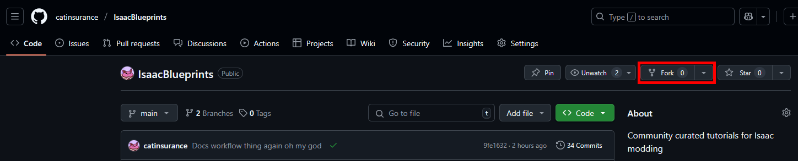
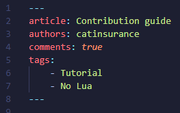
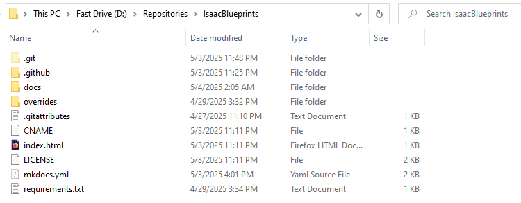
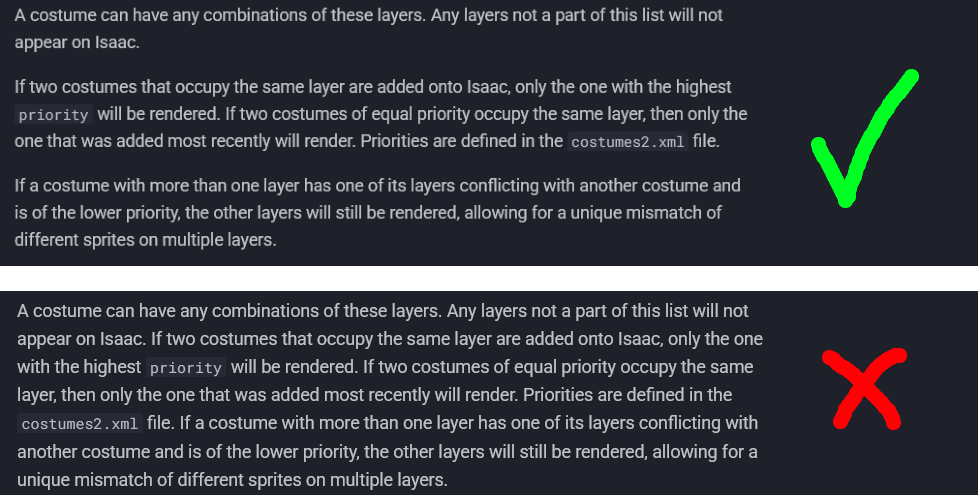

Thanks for showing interest in contributing to Isaac Blueprints! This guide will serve as a quick start to creating articles, as well as a good formatting example itself.

## Contributing
To get started, **create a fork** of [the Isaac Blueprints repository on Github](https://github.com/catinsurance/IsaacBlueprints). Then, clone this respository to your desktop.



To start writing an article or making an edit to an existing one, you should first create a branch that contains the changes you'll be making. After that, create a **Markdown file** in an appropriate subfolder within `docs/tutorials`. Isaac Blueprints is built using [Markdown](https://www.markdownguide.org/cheat-sheet/) and [Material for MkDocs](https://squidfunk.github.io/mkdocs-material/).

If you want to add images, gifs, or other files to your article, create a new folder within `docs/tutorials/assets` named after your article's name. Use snake_case for naming any new files.

**If creating a new article,** please add the appropriate metadata at the top so that the header can be generated properly. It should have the following properties:

- An `article` property with the name of the article. This appears in the primary header.
- An `authors` property with the creator(s) of article. Separate multiple authors with commas (i.e. `authors: joe, bob`).
- A `blurb` property with a short blurb to appear in external embeds (such as on Discord). This should usually be just a single sentence stating what the article covers. We usually have blurbs for tutorials start with the word "learn", but this is not required. `More Binding of Isaac modding tutorials on numerous topics can be found on Isaac Blueprints.` is appended at the end of your blurb, so there's no need to add this yourself.
- A `comments` property for if you want comments to be enabled. This should be `true` or `false`, and should be left as `true` under most circumstances.
- A `tags` property with a list of tags.



???- info "List of tags"
    The following are the allowed tags:

    - Beginner friendly
    - Intermediate
    - Advanced
    - Tutorial
    - Video
    - Lua
    - No Lua
    - Sprites
    - XML
    - Repentance
    - Repentance+
    - REPENTOGON

When you're ready to submit your changes for review, create a pull request on Isaac Blueprints respository using your branch. Your changes will be reviewed by a repository maintainer (usually catinsurance).

## Hosting the docs locally
It is recommended to host the docs locally before creating a pull request with your changes in order to preview the formatting. To host the docs locally, follow these steps:

1. Make sure you have Python downloaded. If on Windows, make sure it was added to PATH. Python does this automatically upon downloading it, as long as you ticked the box.
2. Navigate to repository's directory on your PC with command prompt, and type the follow in order to automatically download all necessary packages.
```
py -m pip install ./requirements.txt
```

3. While still in the directory in command prompt, type `mkdocs serve` to host the site.
4. Visit `localhost:8000` in your browser to see the site!


## Article guidelines
- Avoid first-person pronouns in articles such as "I", "we", or "my".
- Keep articles objective! Try to avoid inserting opinionated statements. If an article requires you to say something opinionated, please denote that what you are saying is not fact.
    - Adding on to this, avoid opinionated language such as "it is recommended". Instead, give examples on *why* such a thing is recommended and allow the reader to come to that conclusion themselves.
- Pay attention to grammar and spelling.
- Every article should have a short preamble explaining what it's about. Use this to establish the article, but avoid providing information that the reader most likely already knows if they've played the game.
- When talking about REPENTOGON in an article not exclusively focused around something regarding it, please use the :modding-repentogon: REPENTOGON emoji (`:modding-repentogon:`) before the sentence mentioning it.
- When referencing an API method for the first time, please create a hyperlink (`[text](https://www.example.com/)`) to its description [in the community docs](https://wofsauge.github.io/IsaacDocs/rep/). This should also be done when referencing an external resource for the first time. After linking things once, there is no need to link it again. **Avoid using the `moddingofisaac.com` mirror of the docs as it is outdated.**

## Choosing what information to provide
Blueprints attempts to be the definitive resource for each topic it covers. To maintain this, we ask that you include and test every aspect of what you're writing about. For example, articles dealing with xml should provide information on every attribute a tag can have, even if some of those attributes have niche use cases.

Another thing to keep in mind is that a lot of readers might be new to modding in general, and may be unfamiliar with certain concepts (e.g. game ticks vs. render ticks). Try and explain how these concepts are relevant to the topic whenever necessary.

Additionally, try and avoid redundancy. There is a delicate balance to find between informational vs. redundant sentences. This balance might be hard to grasp at first, and becomes easier to understand as you write more.

## Formatting
- A Markdown formatting cheat sheet [can be found here](https://www.markdownguide.org/cheat-sheet/).
- When making a header for a section, use two hash symbols (`##`) instead of one.
- Collapsable sections are great for very long sections that can make scrolling back and forth difficult. Prime examples include tables explaining a long list of attributes. You can create an info, warning, or bug collapsable using the following system:
???- info "Collapsable info"
    ```
    ???- info "Closed info collapsable"
        This is a closed info collapsable!

    ???+ info "Opened info collapsable"
        This is a opened info collapsable!
    ```

???- warning "Collapsable warning"
    ```
    ???+ warning "Opened warning collapsable"
        This is a opened warning collapsable!

    ???- warning "Closed warning collapsable"
        This is a closed warning collapsable!
    ```

???- bug "Collapsable bug"
    ```
    ???+ bug "Opened bug collapsable"
        This is a opened error collapsable!

    ???+ bug "Closed bug collapsable"
        This is a closed bug collapsable!
    ```

Additionally, try and avoid creating very large paragraphs. How people read online is different than with a book, and your article becomes a lot more approachable when paragraphs are split up efficiently.

