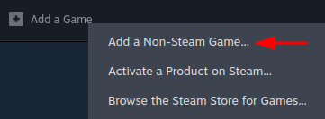
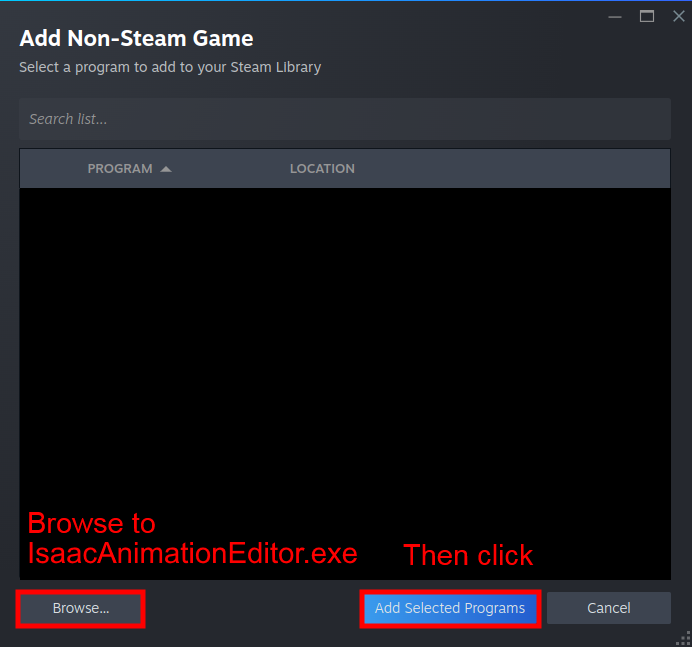
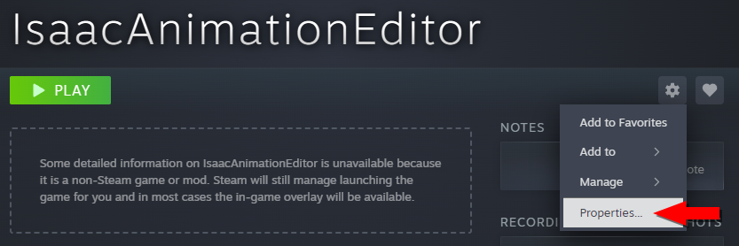
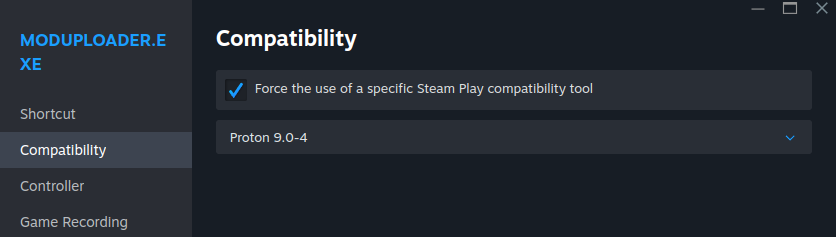
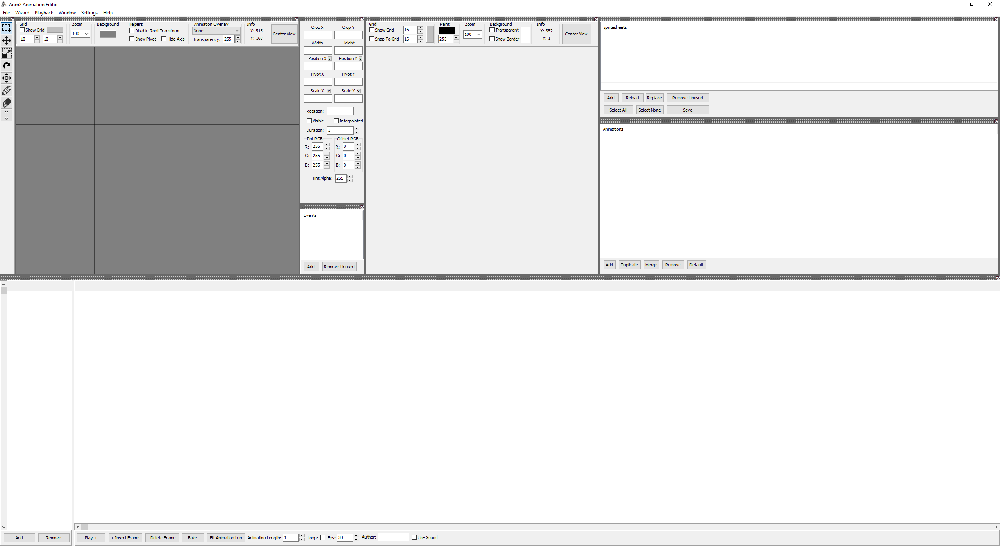
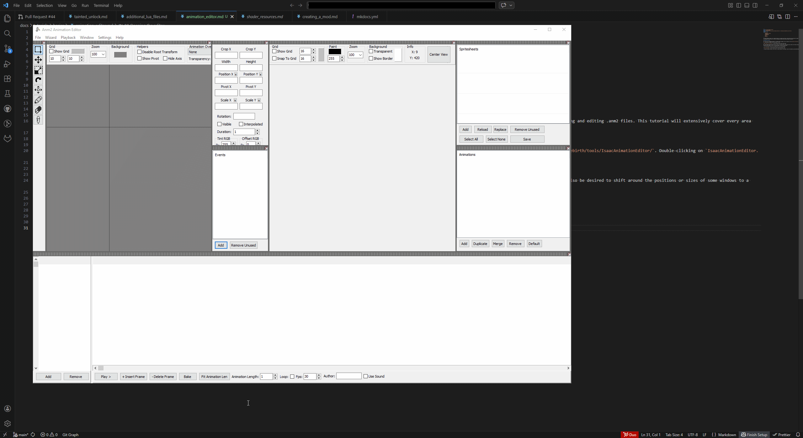
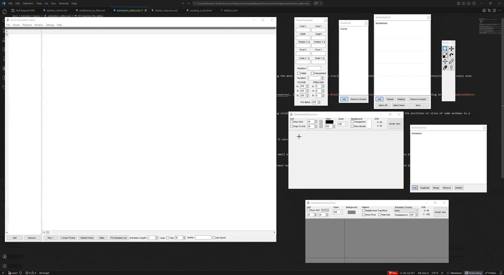
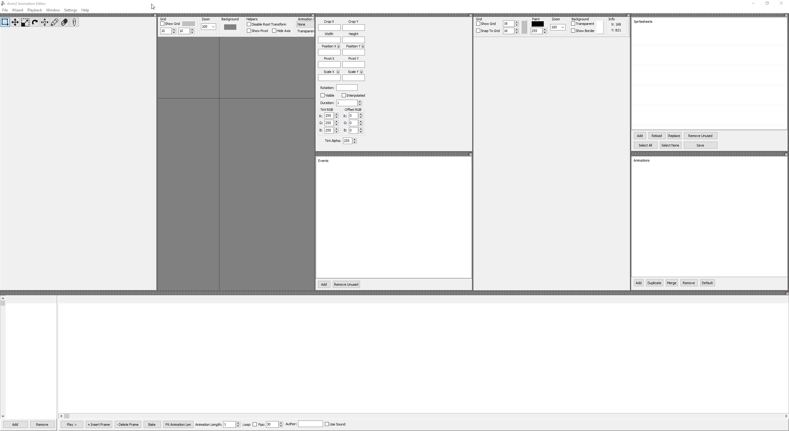
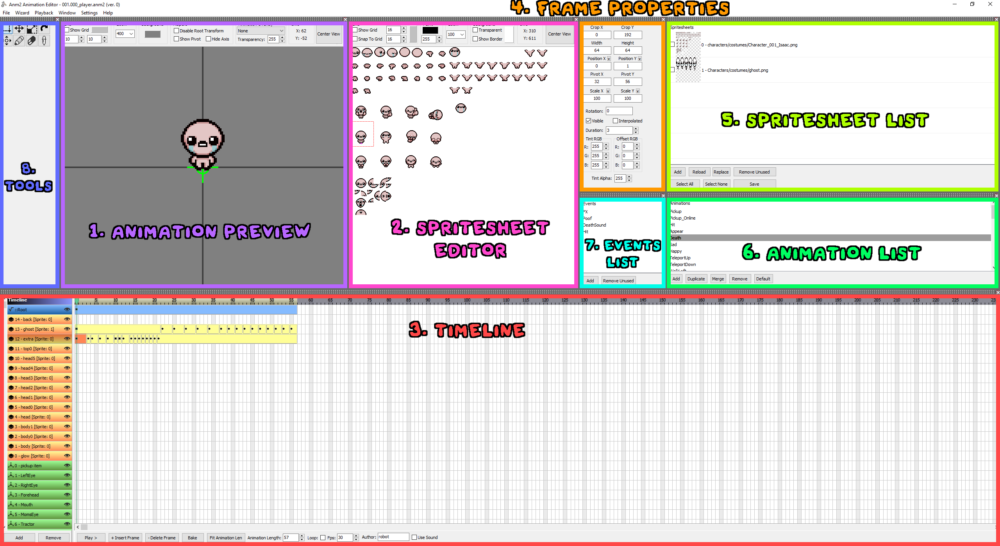

The Isaac Animation Editor was created by Nicalis for editing the `.anm2` file type, which itself was created exclusively for Isaac. The editor appears daunting to use, but it is crucial to learn for creating and editing ANM2 files, as they are the framework for nearly every sprite in Isaac. Without an ANM2 file, a sprite cannot be loaded and displayed.

This tutorial will extensively cover how to utilize the editor to create and modify ANM2 files.

## Using the editor

The animation editor is a program located in the `tools` folder in the game's directory. If you don't see this folder, **make sure you've extracted the game's resources** by following [this tutorial](./creating_a_mod.md) in the crash course. Within the `tools` folder, you'll see `IsaacAnimationEditor.exe`, which is the executable you'll need to launch.

  

???- note "Linux info"
	Linux users may notice a "Linux" folder with a file you can run in the terminal. If you're having issues with this version of the mod uploader, try adding the Windows version as an non-Steam game on Steam, then run it with Proton.

	1. Click the plus (+) at the bottom-left of the Steam app, then click "Add a Non-Steam Game". 
	2. Click "Browse" at the bottom-left of the menu that popped up, and navigate to `IsaacAnimationEditor.exe`. Choose it and click "Add Selected Programs". 
	3. You should now be able to find "IsaacAnimationEditor" in your Steam library. With the IsaacAnimationEditor entry selected, click the gear on the right, then click "Properties". 
	4. Click "Compatibility" on the left, then click "Force use of a specific Steam Play compatibility tool". From this dropdown list, choose "Proton 9.0-4". 
	5. You should be able to launch the editor through Steam and use it normally.

Once opened, the window should look something like this:

### Fixing the window layout

Its possible when opening the editor for the first time that some specific windows may be missing, caused by an abnormality of the sizes of the windows inside the editor. To fix this, follow the steps below:

1. Go to the `Window` tab at the top of the editor and click `Allow Undock`.

2. Resize the editor window so that there is space outside of the window. Click on the grey dotted header on any of the windows inside the editor and drag it outside of the editor.

3. Repeat this for every window until only one remains inside the editor. Now, drag the windows back in. There are small previews that show how the window will be placed back into the editor, however it can be finnicky to get the exact desired result. If the preview or result doesn't look as desired, simply drag the window back out and try again. The layout displayed below is one way you can reorganize the editor's windows, however you are free to customize the placement however you wish.

4. The windows will automatically resize themselves and other windows when placed back in the editor to have an evenly distributed size. To fix this, hold your mouse cursor between two windows; it will turn into a two-sided arrow. Click and drag with the mouse to resize the windows.

If you ever accidentally hit "X" on any windows, it can be brought back by selecting the same `Window` tab as before and selecting the appropriate window to restore.

## Create or load an ANM2 file

The editor will not allow you to interact with its windows until you either create a new ANM2 or load an existing one.

To create a new anm2, select `File` on the top left of the editor and select `Create new`. The editor will prompt you for where to save the file.

By instead clicking `Open` or simply dragging an ANM2 file into the editor, you can load an existing ANM2 file instead. The remainder of this tutorial will have `001.000_player.anm2` loaded for showcasing all of the editor's features.

## Animation Preview

Preview the currently selected animation.  **All attributes are purely for preview purposes and do not affect the visual of the sprite in-game**.

  

- Grid: Displays a grid for aligning sprites. Can be toggled on/off, change the color of the grid, and adjust the size of each tile.

  

- **Zoom**: Size percentage of the preview. Higher percentage is closer to the sprite, while lower is farther away. Select from a list of zoom percentages, type one in the text box manually, or use the middle mouse wheel to zoom in and out.
- **Background**: Change the color of the animation preview's background.
- **Helpers**:
	- **Disable Root Transform**: Disable any modifications made to the "root" layer.

	- **Show Pivot**: Show the pivot of the currently previewed frame per layer. The pivot acts as the center of a frame.
	- **Hide Axis**: Hide the axis for the previewer.

  

- **Animation Overlay**: Select what animation to overlay over the current animation. Useful for previewing sprites that utilize overlay animations.

  

- **Info**: Displays the X and Y coordinates of the mouse cursor relative to the previewer's origin point.
- **Center** View: Pans the preview such that the origin point aligns with the center of the window.

## Spritesheet Editor

Preview the spritesheet on the currently selected layer of animation. Different layers can have different spritesheets, so select a layer in the [Timeline](animation_editor.md#timeline) window with the spritesheet you wish to preview. You can also edit certain aspects of the spritesheet.

  

The red dotted box represents the border of the current frame of animation. The "plus sign" located right inbetween Isaac's legs is called the pivot. The pivot acts as the center of a frame.

  

- **Grid**: Displays a grid for aligning sprites. Can be toggled on/off, change the color of the grid, and adjust the size of each tile. Additionally, the "Snap to Grid" toggle in conjunction with the [Select tool](animation_editor.md#tools) allows you to create a bounding box for the current frame that snaps to the grid.

  

- **Paint**: Edit the transparency and color used by the [Draw tool](animation_editor.md#tools).
- **Zoom**: Size percentage of the preview. Higher percentage is closer to the sprite, while lower is farther away. Select from a list of zoom percentages, type one in the text box manually, or use the middle mouse wheel to zoom in and out.
- **Background**: Change the color of the spritesheet editor's background. Does not affect the actual sprite.
	- **Transparent**: Disables the background color.
	- **Show Border**: Displays a dotted line that represents the boundaries of the spritesheet.
- **Info**: Displays the X and Y coordinates of the mouse cursor relative to the top left corner of the spritesheet.
- **Center View**: Pans the preview such that the top left corner of the spritesheet's border aligns with the top left corner of the window.

## Timeline

Create, edit, and delete animation layers and frames.

There are four types of animation layers: **Spritesheet**, **Null**, **Root**, and **Triggers**. Spritesheet and Null layers can be created and removed, while Root and Triggers layers are built into the ANM2.

  

  

- **Spritesheet** layers are the main layer type. Frames created in these layers will create frames for the spritesheet that the layer is assigned to.
- **Null** layers are the secondary layer type. They have all the same capabilities as spritesheet layers, but are not linked to any spritesheets. They are primarily useful for providing positioning information for the sprite, such as where the left or right eye is positioned on Isaac's head. Accessing null layers is only possible with :modding-repentogon: REPENTOGON using [Sprite:GetNullFrame](https://repentogon.com/Sprite.html#getnullframe).
- The **Root** layer acts as the center point for all layers. Only its position and scale can be changed, which will transform sprites on all the other layers accordingly.
- The **Triggers** layer is responsible for inserting **Events**. Frame duration is restricted to one frame and has no other properties that can be edited other than what Event is assigned to the frame. Used for detecting when to trigger a specific event using [Sprite:IsEventTriggered](https://wofsauge.github.io/IsaacDocs/rep/Sprite.html#iseventtriggered) or [Sprite:WasEventTriggered](https://wofsauge.github.io/IsaacDocs/rep/Sprite.html#waseventtriggered), such as when to play Isaac's death sound effect.
- The **Timeline** displays frame numbers and holds the Timeline Marker. Animations always start at frame **0**, and each frame is marked with an indent, with every **5** frames being additionally marked with its frame number.
- The **Timeline Marker** represents which frame is being previewed on the Animation Preview. It can be held and dragged with the mouse to scroll through the animation's frames.

Double-click a layer to edit its properties. Click the eye on a layer to hide it, which will affect its visibility in-game.

- **Add**: Adds a layer to the ANM2.

	- Layer Name: Name of the layer.
	- Spritesheet Id: Only relevant to spritesheet layers. Corresponds to the Id number shown on the [Spritesheet List](animation_editor.md#spritesheet-list).
	- Rect: Only relevant to null layers. Normally, null layers are represented by a circle, with the scale representing its percentage size. When Rect is enabled, it is represented by a rectangle instead, with scale representing its pixel width and height.
	

- **Remove**: Removes a layer from the ANM2.
- **Play**: Plays back the current animation in the [Animation Preview](animation_editor.md#animation-preview). It will turn into `Stop` while playing, from which it can be selected again to stop the animation.
- **Insert Frame**: Creates a new frame. Will copy all the properties of the last frame in the animation, or if none exist, create a frame with default values.
- **Delete Frame**: Removes the selected frame.
- **Bake**: Splits a single frame into multiple frames based on the provided Interval. If the frame is interpolated, will be able to split the frame's interpolation across those frames.

	- Interval: Duration of split frames. Will shorten the duration of the last frame if necessary in order to match the total length of the original frame.
	???+ bug "Interval being ignored"
		If there is not a frame in front of the frame being baked, it will ignore the Interval property and split the frames into intervals of `1` instead.
	- **Round Scale**: Will round the scale of the frame if it's interpolated.
	- **Round Rotation**: Will round the rotation of the frame if it's interpolated.
- **Fit Animation Len**: The length of the animation will be fit to match the layer with the longest duration of frames.
- **Animation Length**: The total length of the animation. An animation in-game will not play past this length. Can be manually adjusted.
- **Loop**: Toggle whether or not the animation loops in-game. By default, the [Animation Preview](animation_editor.md#animation-preview) will loop all animations and ignore this property, click the `Playback` tab on the top of the editor and uncheck "Always Loop".
- **Fps**: Playback speed of the [Animation Preview](animation_editor.md#animation-preview) in frames per second. Does not affect playback speed in-game.
- **Author**: Specify the author of the ANM2 file. Has no functional purpose.
- **Use Sound**: When checked, the editor will prompt you to select a sound file. When selecting "Play" on an animation, it will automatically play that sound.

## Frame Properties

Edit various properties on the currently selected animation frame.

  

- **Crop**: Position of the frame border originating from the top left corner. Visible in the [Spritesheet Editor](animation_editor.md#spritesheet-editor).
- **Width**/**Height**: Size of the frame border originating from the top left corner. Visible in the [Spritesheet Editor](animation_editor.md#spritesheet-editor).
- **Position**: Horizontal (`X`) and vertical (`Y`) position of the sprite relative to the pivot. Visible in the [Animation Preview](animation_editor.md#animation-preview).
- **Pivot**: Horizontal (`X`) and vertical (`Y`) position of the pivot; origin point of the frame.
- **Scale**: Horizontal (`X`) and vertical (`Y`) size of the frame.
- **Rotation**: Rotational degree set on the frame.
- **Visible**: Toggle if the frame's sprite is visible.
- **Interpolated**: Will automatically interpolate certain properties between frames for a smoother transition between them. Frame's duration must be longer than 1 for interpolation to take effect.

???+ info "Interpolated Properties"
	The following properties of a frame can be interpolated:

	- Position
	- Scale
	- Rotation
	- Tint RGB
	- Offset RGB
	- Tint Alpha

- **Duration**: How long the singular frame lasts; 1 = 1 frame. The ANM2 will continue displaying the last frame of a layer for the remainder of the animation, so if you wish to hide it, create another frame with `Visible` toggled off.
- **Tint RGB**: Red, Green, and Blue values of the frame's color tint ranging from `[0-255]`. Tint acts like a color percentage, where `0` is 0% and `255` is 100%.
- **Offset RGB**: Red, Green, and Blue values of the frame's color offset ranging from `[0-255]`. Offset is a color that gets added to the frame after the Tint is applied.
- **Tint Alpha**: Alpha of the frame ranging from `[0-255]`, where `0` is fully transparent and `255` is fully opaque.

## Spritesheet List

  

Displays the list of spritesheets added to the ANM2.

- **Add**: Adds a spritesheet to the list.
- **Reload**: Reloads any changes made to the selected spritesheet. Checkboxes near the spritesheets must be checked to reload them.
- **Replace**: Prompts you to select a new spritesheet to replace the selected one.
- **Remove Unused**: Removes any spritesheets not used by any layers in the [Timeline](animation_editor.md#timeline).
- **Select All**: Selects all spritesheets.
- **Select None**: Unselects all spritesheets.
- **Save**: If the [Draw tool](animation_editor.md#tools) was used to edit the spritesheet, select `Save` to save the changes onto the spritesheet directly.

## Animation List

Displays the list of animations added to the ANM2.

  

- **Add**: Adds an animation to the list.
- **Duplicate**: Copies all frames of the selected animation into a new animation.
- **Merge**: Pops up a new window named `Animation Merge`. Used to merge the currently selected animation's frames with another.

	- **On Layer Conflict**: Provides four options for deciding what to do if a frame from the source animation conflicts with a frame on the same layer on the target animation. You can choose to append the source animation's frame in front of the target animation's frame, prepend (place before), replace the target animation's frame, or ignore it and keep the target animation's frame.
	- **Delete Animations After Merging**: Will delete the source animation after selecting `Merge`.
- **Remove**: Removes an animation from the list.
- **Default**: Sets the default animation for the ANM2. When an entity spawns, it will always attempt to play its default animation first.

## Events List

Displays the list of events added to the ANM2. When selecting an Event frame, select a name from this list in order to change what event that event frame triggers.

  

- **Add**: Adds a new event to the list.
- **Remove Unused**: Removes any events not used in any of the ANM2's animations.

## Tools

Edits properties on the currently selected frame. Has different or exclusive effects on either the [Animation Preview](animation_editor.md#animation-preview) or [Spritesheet Editor](animation_editor.md#spritesheet-editor).

  

- **Select** *(Spritesheet Editor)*: Click and drag with the mouse to create a new frame border. Can be used in conjunction with the Spritesheet Editor's "Snap To Grid" to have the new frame border snap to the grid. Updates Crop, Height, and Width.
- **Move**:
	- *Animation Preview*: Moves the sprite around. Updates Position.
	- *Spritesheet Editor*: Updates Pivot.
- **Scale** *(Animation Preview)*: Updates Scale.
- **Rotate** *(Animation Preview)*: Updates Rotation. Move up to decrease rotation, move down to increase.
- **Pan**: Can pan the view on both Animation Preview and Spritesheet Editor. Alternatively, hold middle-click to perform the same action.
- **Draw** *(Spritesheet Editor)*: Allows you to draw pixels onto the spritesheet. **Changes are not saved onto the spritesheet until "Save" is selected on the Spritesheet List.**
- **Erase** *(Spritesheet Editor)*: Erases pixels created by the Draw tool.
- **Color Picker** *(Spritesheet Editor)*: Can pick colors on the spritesheet to update the color used by the Draw tool.

  

## Tabs

The tabs at the top of the editor that serve various miscellaneous purposes.

### File

- **New** *(Ctrl+N)*: Create a new ANM2 file.
- **Open** *(Ctrl+O)*: Open an existing ANM2 file.
- **Save** *(Ctrl+S)*: Save the current ANM2 file.
- **Save As** *(Shift+Ctrl+S)*: Prompts the user where to save the ANM2 file.
- **Explore XML Location**: Opens the file location of the ANM2 file.
- **Exit**: Exits the Animation Editor.

### Wizard

- **Generation Animation From Grid**: Select a layer and generate a new group of frames in that layer using the available parameters. Below is an example of how an animation is configured and generated.

	- *Start Position*: Where to start the first frame in the animation.
	- **Frame Width/Height**: The frame border for each frame.
	- **Pivot**: Set where the pivot point of each frame will be.
	- **Rows**: How far horizontally `(Frame Width * Rows)` the wizard goes for generating frames.
	- **Columns**: How far vertically `(Frame Height * Columns)` the wizard goes for generating frames.
	- **Count**: How many frames to generate. The actual count is `Count + 1`, as it will always generate the frame at its starting position.
	- **Delay**: Length of each frame generated (i.e. A delay of 2 will make each frame last 2 frames).
	- **Generate**: Generate the frames into the [Timeline](animation_editor.md#timeline).
	- **Preview**: Generate a preview of the frames. The preview is not automatically updated to reflect any changes in the parameters. Click and drag the slider at the bottom to preview each individual frame.
- **Change All Frame Properties**: Select a layer and change every frame in that layer using the available parameters. Identical to the [Frame Properties](animation_editor.md#frame-properties) window in what it can edit, and has a "Settings" section for changing how the modifications are applied. There are small checkboxes next to every property which must be checked in order to commit the change to each frame. 

	- **From Selected Frame**: If a frame is selected, all changes will only apply from that frame onward.
	- **Nr Frames**: The number of frames to modify. `0` will modify all frames. Works in conjunction with From Selected Frame to specify a range.
	- **Add**: Adds the properties on top of the frame's existing properties (i.e. Frame with a Position Y of `10` and Modified Position Y's textbox has `5`. New Position Y is `15`. )
	- **Subtract**: Subtracts the properties on top of the frame's existing properties (i.e. Frame with a Position Y of `15` and Modified Position Y's textbox has `5`. New Position Y is `10`. )
	- **Adjust**: Overrides the frame's existing properties (i.e. Frame with a Position Y of `10` and Modified Position Y's textbox has `0`. New Position Y is `0`. )
	- **Cancel**: Exits the window without making any changes.
- **Generate Gif Animation**: Generates a Gif animation exactly how it is displayed in the Animation Preview. This includes the background color, visible null and root layers, grid, axis, etc. Hit "Record" to have the editor record the animation, where upon completion it will prompt you where to save the file.

???+ bug "2x Playback Speed"
	The generated gif plays the animation at roughly double the original speed. To get around this, you can change the "Fps" located at the bottom of the `Timeline` window.

### Playback

- **Always Loop**: Toggle whether or not an animation loops or not regardless of the "Loop" toggle in the [Timeline](animation_editor.md#timeline). When disabled, animations with "Loop" disabled will stop playing at the end of their animation.

### Window

The first eight options available in this tab represent each window described in this tutorial. If they are ever closed out with the "X" button on their window, clicking on the respective option inside this tab will restore the window at its original location in the editor.

- **Allow Undock**: Allows windows to be dragged outside of the editor and become their own individual window.

### Settings

- **Associate .anm2 files with Editor**: Automatically associates the Isaac Animation Editor with .anm2 files on your system so that double-clicking on them will automatically open the editor with the selected ANM2 loaded onto it.
- **Remove .anm2 file association**: Removes the aforemention association from your system.

### Help

- **About**: Displays a window with the current version of the editor and a short credits sequence.

  

