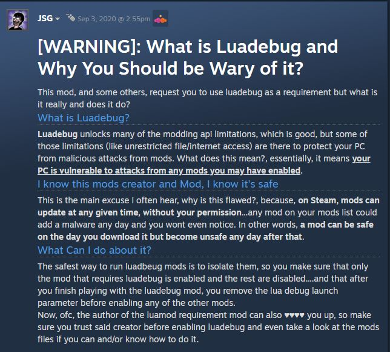

Expanding the scope of your mod's code through the usage of additional lua files is excellent for organization and utilizing libraries.

## Explanation
The `main.lua` file is all a mod needs to run Lua code, but sometimes the scope of your mod can become large enough that it becomes unsustainable to navigate all of the code within a single file. This is where the [require function](https://www.lua.org/pil/8.1.html) and its Isaac-specific relative, `include`, comes in. These functions allow you to load other lua files located within your mod folder and its subdirectories, allowing you to separate sections of code across multiple files. [Libraries](https://en.wikipedia.org/wiki/Library_(computing)) made for Isaac also utilize this function to allow you to insert many new functionalities into your mod with ease by simply dropping the file inside your mod and calling the `require` or `include` function on it.

## `require` and `include`
When loading lua files, you may choose to use `require` or `include`. Both accomplish the same goal, but have their own benefits and drawbacks.

- `require` will load the Lua file and cache it, meaning it will remember that the file was loaded and will not load it a second time on subsequent calls. This means that you can call `require` as many times as you'd like within any file, and the code within will only be loaded once. This is useful for when you want to share certain variables across your mod that shouldn't be reset every time the file is required, or when your code should only run once but needs to be accessed in multiple places. The downside is that when you attempt to make changes to the file while the game is already open and execute the `luamod` command to reload your mod's lua code, it *will not* reload your lua file's contents, meaning you'll have to restart the game for your changes to come into effect. In addition, **if another mod attempts to load the same exact file with the same filepath, it will use the already loaded file instead**. It is recommended to nest all your files under a uniquely named directory specific to your mod.
- `include` will load the Lua file and *not* cache it, meaning it can be loaded multiple times. The benefits are in opposition to `require`, where using the `luamod` command *will* reload your mod's code, allowing for quicker testing and tweaking of your code. The downside is that using `include` more than once on the same file will cause it to load a second instance of that file, meaning the code inside will be ran again. If the file structure of your mod is simple, this can be a non-issue for many developers, and is the preferred method of loading Lua files.

## Loading another lua file
Using the `require` or `include` function to load a lua file is relatively simple. Just call either function and insert the filepath to your lua file as a string as the only argument. No matter where you call the function, **all filepaths start from the root of the mod directory**, which is the same location as your `main.lua` file. When dealing with folders, you can separate the folders within the path with a period (`.`). If using `include`, you can also choose to use `/` instead. Adding the `.lua` file extension at the end of the filepath is not required.

This is an example of all the ways to load a file located in a "scripts" folder named `my_file.lua` (Don't actually load files multiple times like this).

```Lua
require("scripts.my_file")
include("scripts.my_file")
include("scripts/my_file")
```

## Accessing contents from loaded files
Assuming the file loaded successfully with no errors, and that the file has a `return` statement at the end of it that returns a value, the `require`/`include` functions will return that value.

`scripts/the_number_one.lua`

```Lua
return 1
```

`main.lua`

```Lua
local number = include("scripts/the_number_one")
print(number) --This will print "1"
```

If an error occurs while your file is being loaded, the function will return the error message you see in the debug console.

## Workarounds for require and include's restrictions
There are ways to get around the downsides that come with choosing to use either `require` or `include` for loading your lua files.

The method for `require` is a bit too advanced to cover for this tutorial, but you can execute what's known as the "require hack". When your `main.lua` file is loaded again after using the `luamod` command, you can remove all of your cached files from an external file list, allowing `require` to load them again. It is explained in greater detail [here](https://wofsauge.github.io/IsaacDocs/rep/tutorials/Using-Additional-Lua-Files.html#workaround-for-require-problems).

???+ warning
	The require hack requires the usage of the `-luadebug` launch parameter, which can potentially be harmful if used by bad actors. [This post](https://steamcommunity.com/workshop/filedetails/discussion/2214634210/2941369009255606603/) by mod developer JSG goes into detail on why:<br>
	

For `include`, you can load the file contents onto a global variable, or onto a local variable that can be passed along to other files by having the file encased in a function, which can then have required variables be passed as an argument

### `include` global example
Putting returned values from different files into a global variable is convenient for when you need to access them often.
???+ warning
	Global variables exist outside of local environment of your mod and as such can be accessed by other mods. You should typically avoid making global variables, but if you do, ensure it has a name unique to your mod so that there's a low chance of it being used by accident.
`scripts/the_number_nine.lua`

```Lua
return 9
```

`main.lua`

```Lua
_G.MyVeryEpicAndUniqueGlobalName = {}
local nine = include("scripts/the_number_nine")
MyVeryEpicAndUniqueGlobalName.NINE = nine
include("scripts/nine_plus_ten")
```

`scripts/nine_plus_ten.lua`
```Lua
print(MyVeryEpicAndUniqueGlobalName.NINE + 10 + 2) --This will print 21
```

### `include` function example
This method can be useful for when you don't need the returned code as a global.

`scripts/the_number_nine.lua`

```Lua
return 9
```

`scripts/number_plus_twelve`

```Lua
return function(number)
	return number + 12
end
```

`main.lua`

```Lua
local nine = include("scripts/the_number_nine")
local plusTwelve = include("scripts/number_plus_twelve")
print(plusTwelve(nine)) --This will print 21
```