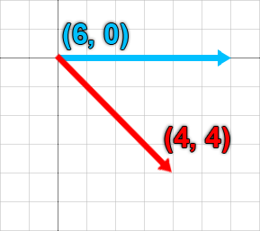
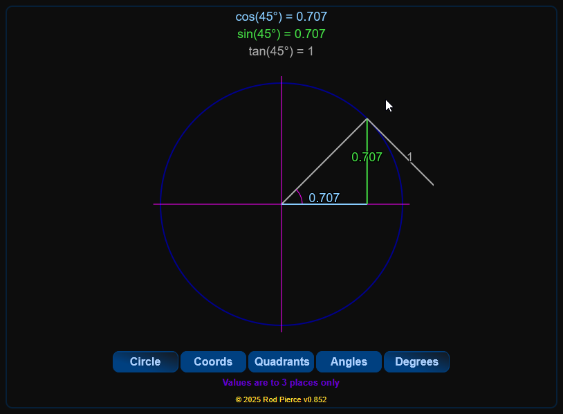
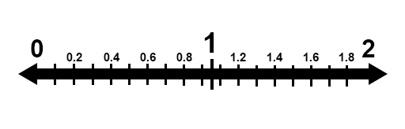
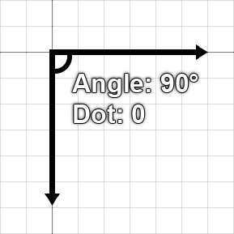

Vector math is an important fundamental concept to understand, especially when working with entities within Isaac.

## What is a vector?

In algebra, a vector can be described as having both **magnitude** and **direction**. This means that a vector can describe size, extents, and direction in 2D space.

**In Isaac (and most 2D games), the origin point for coordinates is the at the top-left of the screen.** This means that a positive X coordinate is pointing towards the right, a positive Y coordinate is pointing downwards, and vice versa.



In the above example, the blue arrow is pointing towards the right across 6 tiles. This would produce a vector of `(6, 0)`, which has a magnitude (or size) of 6.

The red arrow is pointing downwards and towards the right across 4 tiles. This would produce a vector of `(4, 4)`, which represents both the direction and how far in that direction the vector is pointing.

### Unit vectors

A **"unit vector"** is a vector that is **normalized**, meaning it has a length of one. A unit vector is used for representing a direction with no size attached to it. You can find an interactive visualization for unit vectors on a unit circle (a circle with a radius of 1) by clicking [here](https://www.mathsisfun.com/geometry/unit-circle.html) and scrolling down to the "Try it Yourself" section.



## What are vectors used for in Isaac?

Vectors in Isaac are used to determine many things, such as **scale**, **position**, and **velocity**.

- **Scale** is multiplied by the base size of something in order to change how big it is. For example, a [`Sprite`](https://wofsauge.github.io/IsaacDocs/rep/Sprite.html) with a `Scale` of `Vector(1, 1)` is the same size as it is in the spritesheet. If you made that `Scale` equal to `Vector(2, 2)`, it would now be **2 times as big**. If you made it equal to `Vector(2, 1)`, it would be 2 times as **wide**, but **the same height as normal**.
- **Position** is where something is located in 2D space. An [`Entity`](https://wofsauge.github.io/IsaacDocs/rep/Entity.html) with `Position` set to `Vector(20, 20)` would be located 20 units to the **right**, and 20 units **downwards** from the origin point of the room, which is the top-left. In Isaac, **40 units is the length of a single tile.**
- **Velocity** is how fast something is moving in a certain direction. An `Entity` with a `Velocity` of `Vector(0, -20)` would be moving **upwards** at a speed of 20 units.

## Coordinate systems

In Isaac, there are 3 different coordinate systems present, each with varying usages of a single unit.

- **World space** represents the coordinate system used for things within the game world, such as entities.
- **Render space** represents the coordinate system used for things within the rendering plane of the current room. This is independent of the window size.
- **Screen space** represents the coordinate system used to determine the position of something on the screen. This is based on the window size. If the game is running at a resolution of 1920x1080, then the bottom-right of the screen will be `Vector(1920, 1080)`.

You can convert from World coordinates to Render or Screen coordinates using functions found in the [`Isaac`](https://wofsauge.github.io/IsaacDocs/rep/Isaac.html) class.
```lua
local worldPosition = Vector(100, 100)

-- To convert to screen space:
local screenPosition = Isaac.WorldToScreen(worldPosition)

-- To convert to render space:
local renderPosition = Isaac.WorldToRenderPosition(worldPosition)
```

## Manipulating vectors

Now that we know what vectors are and how the game handles them, we can now start to manipulate them. In Isaac, there is a [`Vector`](https://wofsauge.github.io/IsaacDocs/rep/Vector.html) object which holds many useful functions for manipulating vectors.

Let's start with basic arithmetic.

| Arithmetic type | Description | Example |
|:--|:--|:--|
|Addition|Adding together two vectors will combine their X and Y values.|`Vector(2, 2)` + `Vector(1, 1)` = `Vector(3, 3)`|
|Subtraction|Subtracting a vector with another vector will subtract the vector on the left's X and Y values with the vector on the right's.|`Vector(2, 2)` - `Vector(1, 1)` = `Vector(1, 1)`|
|Multiplication|You can multiply a vector with another vector to multiple their X and Y values together, **but you can also multiple a vector with a number.** This is useful for increasing or decreasing the magnitude of a vector, especially unit vectors.|`Vector(1, 1)` × `5` = `Vector(5, 5)` **OR** `Vector(1, 1)` × `Vector(5, 1)` = `Vector(5, 1)`|
|Division|Like with multiplication, you can divide a vector with another vector, or you can divide a vector with a number.|`Vector(4, 4)` ÷ `2` = `Vector(2, 2)` **OR** `Vector(4, 4)` ÷ `Vector(1, 2)` = `Vector(4, 2)`|
|Inversion|You can invert a vector by adding a dash (-) behind it. This means that you can flip the sign of the X and Y values of a number to be negative to positive, or positive to negative.|`-Vector(2, -2)` = `Vector(-2, 2)`|

Beyond basic arithmetic, sometimes it is necessary to want to **resize** or **rotate** vectors, among other common forms of vector manipulation. The modding API has many functions that you can use on `Vector` objects to avoid doing the math for this yourself. Below is a table going over all the basic vector manipulation functions.

| Function | Description | Example |
|:--|:--|:--|
|`Distance`|This can tell you the distance between two vectors that represent a position in 2D space in units.|`Vector(2, 0):Distance(Vector(4, 0))` = `2`|
|`DistanceSquared`|The same as `Distance`, but returns the distance in squared units. This is function has slightly less overhead than `Distance`, as the game doesn't need to calculate the square root.|`Vector(2, 0):DistanceSquared(Vector(4, 0))`|
|`GetAngleDegrees`|Returns a number representing the direction a vector is pointing in, in degrees. **This is relative towards the right**, meaning that right is an angle of 0, down is an angle of -90, up is an angle of 90, and left is an angle of 180 or -180. |`Vector(5, 0):GetAngleDegrees)` = `0`|
|`Normalized`|Returns a vector normalized to be a unit vector, meaning it returns purely the direction the vector is pointing in and nothing else.|`Vector(2, 2)` = `Vector(0.707, 0.707)`|
|`Resized`|Returns a vector normalized and then resized by a certain amount of units. This is useful over simply multiplying a vector, as it allows you to resize a vector of any length without needing to normalize it yourself first.|`Vector(15, 0):Resized(3)` = `Vector(15, 0):Normalized() * 3` = `Vector(3, 0)`|
|`Rotated`|Returns a vector rotated by a certain amount of degrees. This will usually have some floating point imprecisions attached. This means that instead of exactly 0, you may receive a number like `-4.37114e-08`, which is `-0.0000000437114` in standard form. |`Vector(1, 0):Rotated(90)` = `Vector(0, 1)` (excluding any floating point imprecisions)|

`Normalized`, `Rotated`, `Resized` all have counterparts without the "d" at the end which alter the original vector itself instead of returning the result.
```lua
local vec = Vector(2, 0)
vec:Rotate(90)

print(vec) -- Vector(0, 2)
```

Lastly, there's also a **static function** that's a part of the `Vector` class that lets you create a unit vector from a specific angle in degrees. The way you call this function works a little differently than normal. Observe the following example:
```lua
local angle = 90
local v1 = Vector.FromAngle(angle) -- Notice how we use a period (.) instead of a colon (:) here!

print(v1) -- Vector(0, 1)
```

## Advanced vector manipulation

While the most common forms of vector manipulation have already been covered, there are further forms of manipulation you can do with more advanced functions. Make sure you have a strong understanding of vectors before diving into these.

### Linear interpolation

Linear interpolation, or lerp for short, is used to calculate an "in-between" point between two numbers. In our case, it lets us get a position between two vectors.

Before talking about linear interpolation with vectors, first it's important to understand how it applies with basic numbers. Observe the following example:
```lua
function lerp(a, b, percent)
    return a * (1 - percent) + b * percent
end

local halfWay = lerp(0, 2, 0.5)
print(halfWay) -- 1
```

With the above code, we have used the linear interpolation formula calculated with the `lerp()` function. This formula takes the starting number `a`, the ending number `b`, and a target percentage between the two numbers. Remember that percentages are represented with a decimal multiplied by 100, so 0.5 is the same as 50%. 50% of the way from 0 to 2 is 1, and that's what we got from the function.



Linear interpolation is a very important concept to understand for lots of math in programming, but how do we apply it to vectors? The modding API provides a `Lerp()` function we can call on a vector. **This changes the vector it's used on** and does *not* provide a new, altered version of the vector.
```lua
local v1 = Vector(0, 0)
local v2 = Vector(1, 1)
v1:Lerp(v2, 0.5) -- v1 equals Vector(0.5, 0.5) now
```

If you don't want to alter the vector you're calling this function on (`v1` in this example), you should use the `lerp` function provided earlier.
```lua
function lerp(a, b, percent)
    return a * (1 - percent) + b * percent
end

local v1 = Vector(0, 0)
local v2 = Vector(1, 1)

local v3 = lerp(v1, v2, 0.5) -- v3 equals Vector(0.5, 0.5), while v1 and v2 are still the same
```

### Dot product

The dot product between two vectors can be explained as the amount that the first vector is pointing in the same direction as the second vector. This is represented as a number between -1 and 1, with -1 meaning they're facing completely opposite directions, and 1 meaning they're facing the same direction.
```lua
local v1 = Vector(1, 0)
local v2 = Vector(0, 1)

local dotProduct = v1:Dot(v2)
print(dotProduct) -- This returns
```

