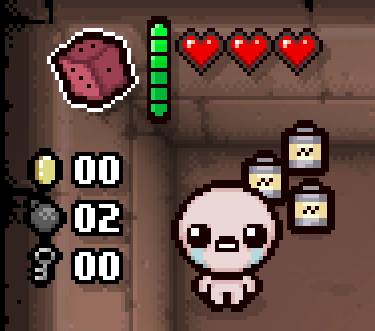
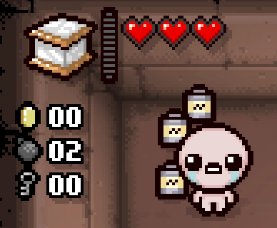



Active items are the only other type of collectible in Isaac apart from passive items. Isaac can usually only hold one active item at a time and they require charges to be activated. This tutorial will branch off of the [passve items page](../crash_course/passive_item.md), so be sure to read that first.

## Video tutorial
(This tutorial covers both Item Pools and Active Items)
[](https://youtu.be/MwsdlW7ZyQ8 "Video tutorial")

## Creating your active item

The process of creating an active item is identical to that of a passive item, replacing the `passive` tag with `active`. However, there are a few unique attributes exclusive to active items.

```XML
<items gfxroot="gfx/items/" version="1">
    <active id="1" name="Big Red Button" gfx="big_red_button_item.png" description="It's a big red button" quality="4" maxcharges="6" chargetype="normal"/>
</items>
```

???- info "`active`-exclusive tag variables"
	???+ note
		All tags are optional.
	| Variable Name | Possible Values | Description |
	|:--|:--|:--|
	| maxcharges | int | `0` by default. When chargetype is set to `timed`, this attribute is used to define the cooldown of the item in frames. 30 = 1 second. |
	| chargetype | string | Possible values: [`normal`, `timed`, `special`]. `normal` by default.|
	| passivecache | bool | `false` by default. Calls a cache evaluation when picked up, as the `cache` flag for active items will only trigger upon item activation. |

## Explaining charge types
There are **three** types of charge an active item can have that affect its method of being charged.

- `normal`: The standard, default method of charging. Charges through room clears, battery pickups, and other conventional methods. It's recommended to stick to one of the following charge amounts: [`0`, `1`, `2`, `3`, `4`, `6`, `8`, `12`].<br>
- `timed`: Can charge all the same ways `normal` charge type items do. Will automatically fill its chargebar over time.<br>
- `special`: Cannot be charged through any conventional means. Requires Lua code to charge manually.<br>

## Coding the active item
The active item now exists, but does not do anything on its own upon activation. This will require Lua code in order to give it an effect when used. The crucial callback for active items is [ModCallbacks.MC_USE_ITEM](https://wofsauge.github.io/IsaacDocs/rep/enums/ModCallbacks.html#mc_use_item).

Inside your `main.lua`, get your active item's ID and create a function attached to a `MC_USE_ITEM` callback.
```Lua
local mod = RegisterMod("My Mod", 1)

local bigRedButton = Isaac.GetItemIdByName("Big Red Button")

function mod:RedButtonUse(item)

end

--Will call the mod:RedButtonUse function upon activating our active item.
--Our item's ID is inserted at the end of the AddCallback function as this callback accepts an optional argument
--to specify which active item should trigger our code.
mod:AddCallback(ModCallbacks.MC_USE_ITEM, mod.RedButtonUse, bigRedButton)
```

For this example, this item will kill every enemy in the room upon use.

```Lua
local mod = RegisterMod("My Mod", 1)

local bigRedButton = Isaac.GetItemIdByName("Big Red Button")

function mod:RedButtonUse(item)
	--Gets every entity in the room, as there are no specialized methods of getting only enemies.
	local roomEntities = Isaac.GetRoomEntities()
	--Loop through the list of entities.
	for _, entity in ipairs(roomEntities) do
		--Will check if it is an enemy and is susceptible to damage.
		if entity:IsActiveEnemy() and entity:IsVulnerableEnemy() then
			--Kill it.
			entity:Kill()
		end
	end

	--Returns a table of variables that dictate the behavior of the active item once it's been used.
	return {
		Discharge = true,
		Remove = false,
		ShowAnim = true
	}
	--The Afterbirth+ method of only returning `true` will also replicate the return behavior seen above.
	--return true
end

mod:AddCallback(ModCallbacks.MC_USE_ITEM, mod.RedButtonUse, bigRedButton)
```

### Adding charges manually
If you have a `chargetype` of `special`, you will require the use of [EntityPlayer:SetActiveCharge](https://wofsauge.github.io/IsaacDocs/rep/EntityPlayer.html#setactivecharge). If you have :modding-repentogon: REPENTOGON, you can also use [EntityPlayer:AddActiveCharge](https://repentogon.com/EntityPlayer.html#addactivecharge) and set the `Force` argument to `true`.

This snippet of code will loop through the player's inventory of active items, as they can appear in multiple different slots, and increases its charge by 1 every 10 seconds.

```Lua
local mod = RegisterMod("My Mod", 1)

local game = Game()

local bigRedButton = Isaac.GetItemIdByName("Big Red Button")

local ONE_SECOND = 30
local TEN_SECONDS = ONE_SECOND * 10
--Will need to compare against the maximum amount of charges later to see if the active needs to be charged.
local MAX_CHARGE = Isaac.GetItemConfig():GetCollectible(bigRedButton).MaxCharges

function mod:ChargeActiveItem(player)
	--Only run this code if we have our active item and that the game's timer has hit an interval of ten seconds.
	if player:HasCollectible(bigRedButton) and game:GetFrameCount() % TEN_SECONDS == 0 then
		--Will loop through the primary, secondary (from Schoolbag), and pocket item slot for active items.
		for slot = ActiveSlot.SLOT_PRIMARY, ActiveSlot.SLOT_POCKET do
			local maxCharge = MAX_CHARGE
			local charge = player:GetActiveCharge(slot)
			--Important to remember that The Battery will double the maximum charge of all actives.
			if player:HasCollectible(CollectibleType.COLLECTIBLE_BATTERY) then
				maxCharge = maxCharge * 2
			end
			--Check that it's our active item and it needs to be charged.
			--There is an EntityPlayer:NeedsCharge() function, but it will always return `false` for `special` chargetype actives.
			if player:GetActiveItem(slot) == bigRedButton and player:GetActiveCharge(slot) < maxCharge then
				--Will use the REPENTOGON-exclusive method of adding charges to the item, if available. Otherwise, uses the traditional method.
				if REPENTOGON then
					player:AddActiveCharge(1, slot, true, false, true)
				else
					player:SetActiveCharge(charge + 1, slot)
				end
			end
		end
	end
end

mod:AddCallback(ModCallbacks.MC_POST_PEFFECT_UPDATE, mod.ChargeActiveItem)
```