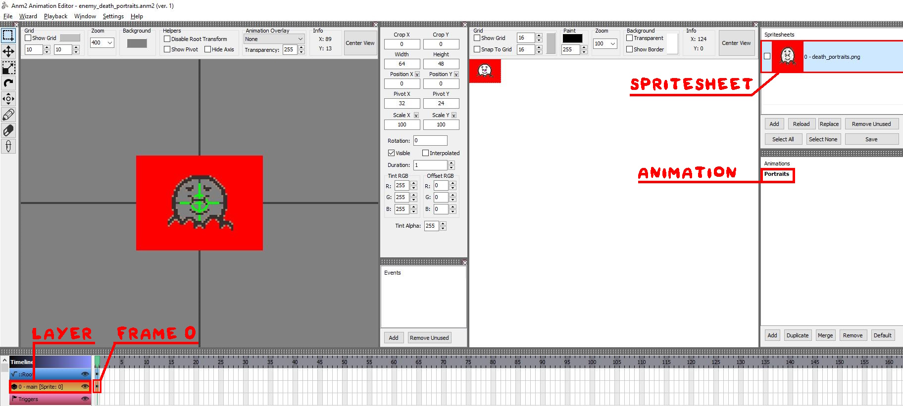
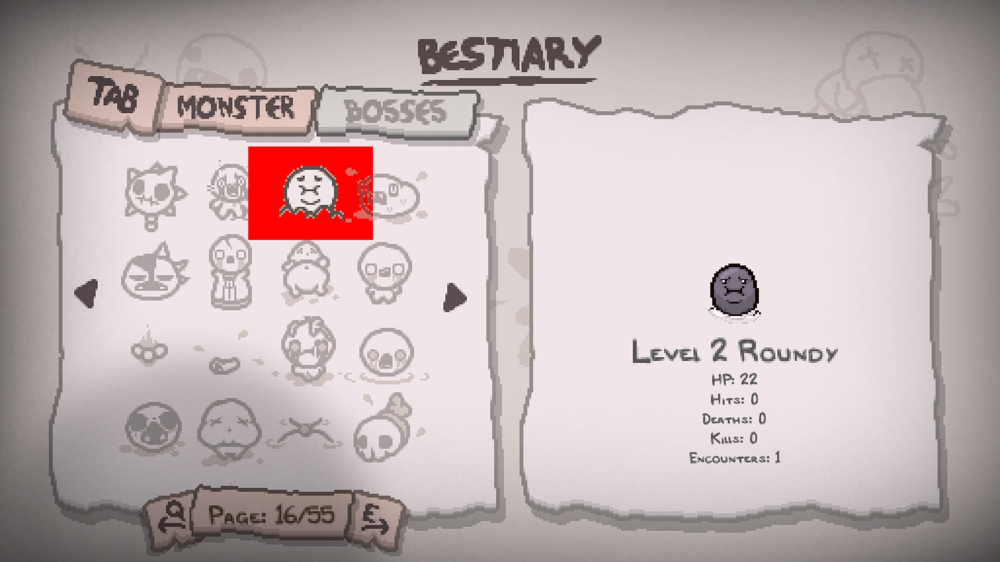



Enemies (or `EntityNPCs` as the game defines them) make up an important part of Isaac's gameplay. This tutorial will cover the bare essentials for creating an enemy. This tutorial will *not* cover enemy AI or having them appear within rooms.

## Video tutorial
[](https://youtu.be/IJYoq90NUQM "Video tutorial")

## entities2.xml entry

As with any entity, the enemy needs to be defined first. The previous article on [entity basics](entity_basics.md) covered many of the tag variables that could be applied to any entity. This section will cover tags that have exclusive functionality to enemies.

???- info "`entity` tag variables"
    | Variable Name | Possible Values | Description |
	|:--|:--|:--|
	| boss | int | Whether or not the entity is considered a boss. 1 = allowed, 0 = disallow. Default = '0'. |
	| bossID | int | Custom entities cannot take advantage of this. The unique boss ID associated with the entity, used for other things such as entries inside `bosspools.xml`. |
	| champion | int | Allow champion variants of this entity. 1 = allowed, 0 = disallow. Default = '0'. |
	| stageHP | int | How much additional maximum health the entity gains with each stage. Read [here](https://bindingofisaacrebirth.wiki.gg/wiki/Stage_HP) for more information. |
	| portrait | int | Used in conjunction with the entities `deathanm2` tag to determine what portrait to show on [Isaac's Last Will](https://bindingofisaacrebirth.wiki.gg/wiki/Isaac%27s_Last_Will). The number correlates to the frame in the anm2 file, starting from `0`. Required for the entity being displayed in the Bestiary.<br>See [Addiing the enemy to the Bestiary](enemies.md#adding-the-enemy-to-the-bestiary) for more information. |
	| hasFloorAlts | bool | If set to `true`, floor specific sprites should be used for this entity if they exist. Default = `false`.<br>See [Floor specific sprites](enemies.md#floor-specific-sprites) for more information. |
	| reroll | bool | Deprecated as of Repentance. Use the [noreroll tag](entity_basics.md#tags-explanation) instead. |
	| shutdoors | bool | Determines whether this entity will prevent doors from staying closed. Only used for enemies. Default = `true`. |
	| shieldStrength | int | Entity takes less damage relative to Isaac's DPS, known primarily as "armor". The higher the number, the less damage is taken. Default = `0`.<br>See [this page](https://bindingofisaacrebirth.wiki.gg/wiki/Damage_Scaling) for more information on the mechanic. |
	| bestiaryAnim | string | Unused by vanilla and was an old way for defining bestiary entries. <br>See [Addiing the enemy to the Bestiary](enemies.md#adding-the-enemy-to-the-bestiary) for more information about the Bestiary. |
	| bestiaryOverlay | string | Unused by vanilla and was an old way for defining bestiary entries. <br>See [Addiing the enemy to the Bestiary](enemies.md#adding-the-enemy-to-the-bestiary) for more information about the Bestiary. |

A full entities2.xml entry on a custom enemy named "Level 2 Roundy". Refer back to this entry for subsequent chapters below.
```xml
<entities anm2root="gfx/" version="5" deathanm2="gfx/enemy_death_portraits.anm2">
    <entity name="Level 2 Roundy"
    id="678" anm2path="monsters/roundy2/roundy2.anm2" portrait="0"
    collisionMass="100" collisionRadius="20" friction="1"
    numGridCollisionPoints="8" shadowSize="0" champion="1"
    baseHP="22" stageHP="0" collisionDamage="1">
        <gibs amount="6" blood="1" eye="1" gut="1" />
        <bestiary anim="Idle" transform="0,0,1" />
        <devolve id="276.0.0" weight="1" />
    </entity>
</entities>
```

???+ note "Defining IDs for custom enemies"
	There are hundreds of mods on the Steam Workshop that add custom enemies. Unfortunately, if two enemies from two different mods happen to have the same id and variant, it will not automatically assign a new variant. 
    
    To mitigate this conflict occuring, group your enemies under the same `id` and make lots of `variants` for completely custom enemies, or repeat this for `variant` and `subtype` for variations of existing vanilla enemies. Define arbitrary large numbers under the cap of `4095` (or `255` for subtypes) to lessen the chance of conflicting IDs.

### Floor specific sprites
If an entity has the attribute `hasFloorAlts` set to `true`, the game tries to load the spritesheet of the entity with an additional suffix, based on the current stage. The suffix of a stage is defined in the `suffix` attribute in the stages.xml file. If no sprite can be found, it will load the default spritesheet.

For example, if the original spritesheet's file path is `monster_017_gaper.png` and the suffix is `_downpour`, the spritesheet will be replaced with `monster_017_gaper_downpour.png` if it exists.

**Suffix per stage:**

| Stage-Name | Suffix |
|:--|:--|
|Flooded Caves|_downpour|
|Downpour|_downpour|
|Dross|_dross|
|Ashpit|_ashpit|
|Mausoleum|_mausoleum|
|Gehenna|_gehenna|

:modding-repentogon: REPENTOGON adds a floor suffix to every stage in the game.

???- note ":modding-repentogon: REPENTOGON stage suffixes"
	- Flooded Caves does not have its own suffix due to the vanilla game tying it to Downpour instead.
	- The Void does not have its own suffix as it generates random rooms from other stages and uses the local stage ID of the current room for its set of floor alt skins.

    | Stage-Name | Suffix |
    |:--|:--|
    |Basement|_basement|
    |Cellar|_cellar|
    |Burning Basement|_burningbasement|
    |Caves|_caves|
    |Catacombs|_catacombs|
    |Flooded Caves|_downpour|
    |Depths|_depths|
    |Necropolis|_necropolis|
    |Dank Depths|_dankdepths|
    |Womb|_womb|
    |Utero|_utero|
    |Scarred Womb|_scarredwomb|
    |Blue Womb/???|_bluewomb|
    |Sheol|_sheol|
    |Cathedral|_cathedral|
    |Dark Room|_darkroom|
    |Chest|_chest|
    |Downpour|_downpour|
    |Dross|_dross|
    |Mines|_mines|
    |Ashpit|_ashpit|
    |Mausoleum|_mausoleum|
    |Gehenna|_gehenna|
    |Corpse|_corpse|
    |Home|_home|

### `devolve` child tag

When this entity is devolved through the [D10](https://bindingofisaacrebirth.wiki.gg/wiki/D10) collectible or :modding-repentogon: [Game:DevolveEnemy](https://repentogon.com/Game.html#void-devolveenemy-entity), this tag is used to determine what entity it should be devolved into. The game only uses the first `devolve` tag defined.

| Variable Name | Possible Values | Description |
|:--|:--|:--|
| id | string | The entity to devolve into. This variable is unique where the ID, variant, and subtype are all combined into one string separated by periods in the format of `Type.Variant.Subtype` (e.g. A regular Gaper would be defined as `10.1.0`). Effect entities should use the type of 999 instead of 1000, as 1000 is reserved for rocks (used by Stone Grimaces). For rocks, the variant and subtype is ignored. |
| weight | float | Completely ignored by the game, but would likely be used to determine the relative likelihood of this devolution be chosen. Default = `1`.

[Level 2 Roundy](enemies.md#entities2xml-entry) has the following definition for their `devolve` tag, which devolves into a [Roundy](https://bindingofisaacrebirth.wiki.gg/wiki/Round_Worm#Roundy):
```xml
<devolve id="276.0.0" weight="1" />
```

## Adding the enemy to the Bestiary

For your enemy to be seen within the [Bestiary](https://bindingofisaacrebirth.wiki.gg/wiki/Bestiary_(Repentance)), three requirements must be met:

1. The `bestiary` child tag exists.
2. The `portrait` variable exists.
3. Your enemy has been encountered at least once within a run.

The `bestiary` child tag has a few variables to specify how the enemy is displayed in the Bestiary when selected. Any animations that play will automatically loop, even if not defined as a looping animation in the anm2 file.

| Variable Name | Possible Values | Description |
|:--|:--|:--|
| anim | string | Animation to play for the entity in the entity's anm2. |
| transform | string | A comma-separated string of X and Y coordinate position offsets and custom scale, defined as `"X,Y,Scale"`. Scale is a multiplier. Default = `0,0,1`. |
| overlay | string | An optional overlay animation to play for the entity. This will play a separate animation that renders over the `anim` sprite animation. |
| anm2path | string | An optional separate anm2 file to use exclusively for the Bestiary. |
| alt | string | An optional floor alt to use (e.g. `_downpour`). Omit to not use a floor specific sprite.

For the `portrait` variable, you will need an anm2 file defined in the `deathanm2` variable within the `entities2` root tag and placed within your mod's `content/gfx/` folder. There must be one animation and one layer that contains frames for every single portrait. The first frame is frame `0`, so your portrait variable should start from `0`.

[Level 2 Roundy](enemies.md#entities2xml-entry) has their portrait set to `0`, alongside the following definition for their `bestiary` tag:
```xml
<bestiary anim="Idle" transform="0,0,1" />
```
The preview animation will play the animation in the anm2 file named "Idle". The X and Y offsets for the animation are 0, and the scale of the animation is 1.


