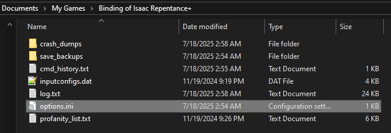
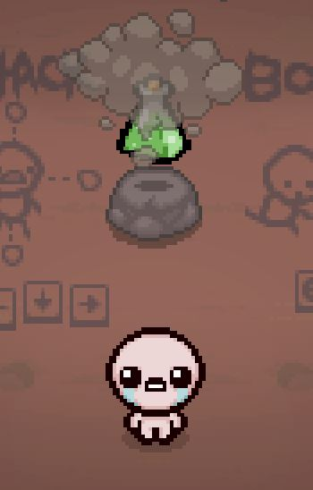
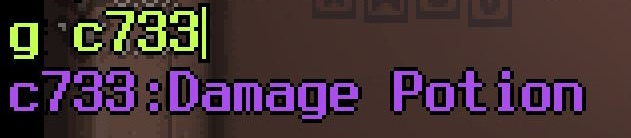



Items are an integral part of the gameplay of The Binding of Isaac. They modify Isaac's attributes, grant or modify tear effects, and much more. This tutorial covers how to create passive items, which as the name implies, grants an effect that is always active.

## Video tutorial
[](https://youtu.be/JVjcRLm13qc"Video tutorial")

## Creating your item
Creating an item is relatively simple. You need only an `items.xml` file and an entry for your item within it.

```XML
<items gfxroot="gfx/items/" version="1">
    <passive id="1" name="Damage Potion" gfx="damage_potion_item.png" description="It smells like ashes and anger" quality="1" cache="damage" />
</items>
```

For every XML file, there is a tag that goes from the start of the file to the end of the file, and multiple "child tags" that act as the individual entries. In this instance, items.xml entries will start with `<items>` and end with `</items>`, while individual item entries have multiple different options depending on the type of item you're creating. The available tag types are `passive`, `active`, `familiar`, and `trinket`. For the purposes of this tutorial, we will be covering using `passive`:

???- info "root `items` tag variables"
	???+ note
		The variables in the items tag can be changed but should never be removed
	| Variable Name | Possible Values | Description |
	|:--|:--|:--|
	|gfxroot|string|Root path of all item sprites, set to `gfx/items/` by default. The game will automatically use the appropraite folder based on the type of item it is. Passive and active items will be located in the `collectibles` folder. Used with the `gfx` variable.|
	|version|string|The version of the items.xml format. **This must always stay equal to 1**.|
	|deathanm2|string|Optional. Root path of the anm2 file used for miniature sketch sprites of the item seen in Isaac's Last Will, the Collection Page on the main menu, and on the pause menu.|

???- info "`passive` tag variables"
	???+ note
		Only a `name` is required to create an item, but all items should be created with a `description`, `gfx`, and `quality`.
	| Variable Name | Possible Values | Description |
	|:--|:--|:--|
	| id | int | Used for associating costumes and death-portrait/collection-page sprites with an item. |
	| cache | string | Possible values : [firedelay, damage, speed, range, tearcolor, tearflag, color, size. shotspeed, all, luck, flying, weapon, familiars]. |
	| name | string | Name of the item. Also used as an identifier for your item. |
	| description | string | Description of the item as it appears when collected by Isaac. |
	| gfx | string | Path to the item image. Must be a .png saved at a bit-depth of 32 bits. |
	| tags | string | Multiple tags must be separated with a space; see [here](https://wofsauge.github.io/IsaacDocs/rep/xml/items.html#tags-documentation) for possible values and descriptions. |
	| bombs | int | Number of added bombs upon pickup. |
	| keys | int | Number of added keys upon pickup. |
	| coins | int | Number of added coins upon pickup. |
	| hearts | int | Number of added red hearts upon pickup. Will fill heart containers, not grant them. |
	| soulhearts | int | Number of added soul hearts upon pickup. |
	| blackhearts | int | Number of added black hearts upon pickup. |
	| maxhearts | int | Number of added empty heart containers upon pickup. |
	| cooldown | int | Number of frames until this item's associated CollectibleEffect is auto-removed if granted. CollectibleEffects are automatically granted by active items on use. |
	| special | bool | Retired mechanic since Repentance. Used to mark the item as "special", which would have a chance of being rerolled if you saw another special item earlier in the run. |
	| devilprice | int | Heart container cost of the item to purchase in a devil deal. Possible values: ['1','2'] |
	| shopprice | int | Cent cost of the item to purchase in a shop. |
	| addcostumeonpickup | bool | True if your item adds a costume upon pickup. This is set automatically if you attach a costume to your item. |
	| persistent | bool | Determines whether the item's associated CollectibleEffect is retained when transitioning between rooms, or across save & continue. CollectibleEffects are automatically granted by active items on use. `false` by default. |
	| achievement | int | Ties the item to be unlocked by a vanilla achievement. |
	| quality | int | Possible values: ['0', '1', '2', '3', '4']. |
	| craftquality | int | Possible values: ['-1', '0', '1', '2', '3', '4']. A value of -1 prevents this item from appearing in Bag of Crafting. |
	| hidden | bool | Prevents the item from appearing in Death Certificate, or on the collection menu (e.g. Familiar-ItemType Damocles). |
	| cleareffectsonremove | bool | Clears any effects of the item upon removal. Note: This is currently not used by any vanilla item. |

:modding-repentogon: REPENTOGON adds its own set of `item` tag variables.

???- info ":modding-repentogon: REPENTOGON-exclusive `item` tag variables"
	| Variable Name | Possible Values | Description |
	|:--|:--|:--|
	| achievement | int or string | Ties the item/trinket to be unlocked by an achievement. For modded achievements use the corresponding `name` xml attribute value. |
	| customtags | string | Define an arbitrary tag, or set of tags, that can be used in a similar fashion to the vanilla game's item tags. Explanation on how to use them can be found [here](https://repentogon.com/xml/items.html#customtags) |

## Obtaining your item through the debug console
Your item now exists in the game, but is unobtainable through any legitimate means. You must give yourself the item through the debug console, either by granting it to Isaac directly or spawning a pedestal. We will cover how to do both methods.

### Non-REPENTOGON
Without REPENTOGON, using the debug console is slightly tedious to enable and use.

1. Open the debug console. It can be opened with the tilde (~) key. If it's not enabled, you can navigate to `Documents/My Games/Binding of Isaac Repentance` (or `Binding of Isaac Repentance+` for Repentance+ users) and open options.ini. Find EnableDebugConsole and change the 0 to 1 and save the file.<br>


2. With the debug console open, type `g` followed by a space, then the name of your item. All collectibles start with the letter `c`, followed by their internal ID number, then their name. Once it appears as the first option in the list, hit ENTER. Hitting ENTER again or ESC will close the debug console. Isaac should now have your new item.<br>

3. For spawning the item, note the internal ID number from earlier. Open the console again and type the command `spawn 5.100.` followed by the ID number. The collectible should spawn.<br>


4. As an additional note, if there is ever a case where you cannot give yourself the item via name due to the names of other items taking priority, you can type out `g c` followed by the the ID number as a reliable alternative.<br>


### :modding-repentogon: REPENTOGON
With REPENTOGON, the debug console is automatically enabled and more convenient to use.

1. Open the debug console. It can be opened with the tilde (~) key. The debug console window will pop up
2. Select the text box, type `g` followed by a space, then the name of your item. Hit TAB or select the autofill entry and hit ENTER. Hitting ENTER again or ESC will close the debug console. Isaac should now have your new item.<br>

3. For spawning the item, the process is the exact same, except start the command with `spawn` instead of `g`.<br>


## Using Lua with your item
There are lots of capabilities with a passive item that cannot be accomplished in the `items.xml` entry. This will require Lua. Although how to use Lua will not be covered here, below is a small snippet of code as an example of how to only execute code if Isaac has your item.

```Lua
--Requirement to use any Lua callbacks
local mod = RegisterMod("My Mod", 1)

--As the internal ID of modded items are not consistent, this will fetch the ID for you.
local damagePotion = Isaac.GetItemIdByName("Damage Potion")

--Defines how much damage the item grants to Isaac. Stored here for easier access and a clear indicator as to what it's used for
local damagePotionDamage = 1

function mod:EvaluateCache(player, cacheFlags)
	--This is the most common way of checking if Isaac has a specific item.
	if player:HasCollectible(damagePotion) then
		--How many of your item Isaac has
		local itemCount = player:GetCollectibleNum(damagePotion)

		--Multiplies the number of your item Isaac has with the damage up. This means multiple of your item will stack the damage bonus!
		local damageToAdd = damagePotionDamage * itemCount

		--Adding the damage to Isaac
		player.Damage = player.Damage + damageToAdd
	end
end

--MC_EVALUATE_CACHE will evaluate the stats of the player, taking place AFTER all vanilla items.
--This passes the player whos stats are being evaluated and the CacheFlag, defining which stat is being evaluated
--The extra "CacheFlag.CACHE_DAMAGE" on this specific callback ensures that this code will ONLY run when evaluating damage
mod:AddCallback(ModCallbacks.MC_EVALUATE_CACHE, mod.EvaluateCache, CacheFlag.CACHE_DAMAGE)
```

Below is a list of links to helpful pages with more information on some of the code used in this snippet:

- [MC_EVALUATE_CACHE](https://wofsauge.github.io/IsaacDocs/rep/enums/ModCallbacks.html#mc_evaluate_cache)
- [CacheFlag](https://wofsauge.github.io/IsaacDocs/rep/enums/CacheFlag.html)
- [HasCollectible](https://wofsauge.github.io/IsaacDocs/rep/EntityPlayer.html#hascollectible)
- [GetCollectibleNum](https://wofsauge.github.io/IsaacDocs/rep/EntityPlayer.html#getcollectiblenum)