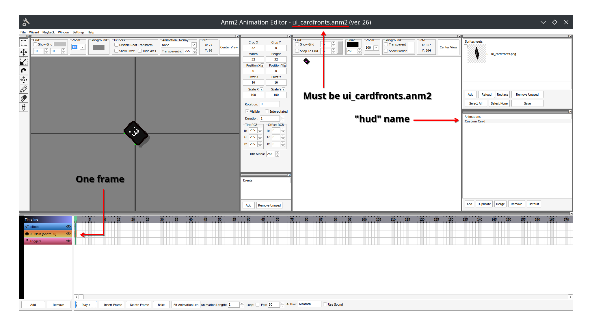
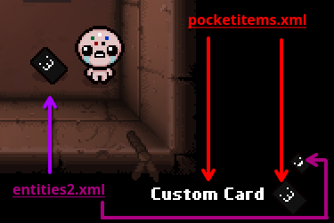
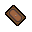



Pocket items are consumable one-time-use items that Isaac can collect and store in his pocket item slot on the bottom right of the HUD. This tutorial covers the essentials for how to create your own pocket item and making it into a card.

## Introduction

When boiling pocket items down to their base essentials and how they are coded within the game, there are only truly two categories of pocket items: pills and cards. "Cards" make up everything that isn't a pill, notably anything that visually looks like a card, runes, and miscellaneous objects. This tutorial will cover the essentials to creating a card, which can be applied to runes and objects as well. If you wish to create a pill, see the [next article](pocket_item_pills.md) in the crash course.

## pocketitems.xml

To start, create a [pocketitems.xml](https://wofsauge.github.io/IsaacDocs/rep/xml/pocketitems.html) file inside your mod's content folder. It starts and ends with the `pocketitems` tag with no other variables. Creating cards requires the `card` child tag. Below are all the variables available to build your card entry:

???+ note "`rune` tag"
    Many vanilla runes do use the `rune` tag, but its available variables and functionality are identical to that of using the `card` tag with `type` set to `rune`. Either method can be used and is up to personal preference.

???- info "`card` tag variables"
    ???+ note
		`hud`, `type`, `name`, `description`, and `pickup` tags are required for a basic pocket item. All others are optional.
    ???+ bug
        Having `pickup` defined with an invalid ID (Not an existing subtype of type `5` and variant `300`) will cause it to have the appearance of a Playing Card when spawned, but will crash when collected.
	| Variable Name | Possible Values | Description |
	|:--|:--|:--|
    |name|string|The display name of the card.|
    |description|string|The description of the card as it appears when collected by Isaac or when holding the card and holding the "TAB" key.|
    |hud|string|Used as the identifier for your card. Also used for the card's front animation in `content/gfx/ui_cardfronts.anm2`.|
    |type|string|Possible values: [`tarot`, `tarot_reverse`, `suit`, `special`, `rune`, `object`]. All types other than `object` and `rune` can be mimicked with [Blank Card](https://bindingofisaacrebirth.wiki.gg/wiki/Blank_Card), while cards of type `rune` can be mimicked with [Clear Rune](https://bindingofisaacrebirth.wiki.gg/wiki/Clear_Rune). The type also affects the spawn chance of the card which is handled by the game automatically. More information can be found on the Official Isaac Wiki [here](https://bindingofisaacrebirth.wiki.gg/wiki/Cards_and_Runes#Probabilities).|
    |mimiccharge|int|The amount of charge the card should take to mimic with [Blank Card](https://bindingofisaacrebirth.wiki.gg/wiki/Blank_Card) / [Clear Rune](https://bindingofisaacrebirth.wiki.gg/wiki/Clear_Rune).|
    |pickup|int|The entities2.xml subtype corresponding to this card's pickup.|
    |announcer|int|The sound ID to play when the card is used.|
    |announcerdelay|int|The delay in frames between card use and the sound provided being played.|
    |achievement|int|Ties the card to a vanilla achievement.|
    |greedmode|bool|Is the pocketitem available in greedmode. Default = `true`|

:modding-repentogon: REPENTOGON expands `pocketitems.xml` with the following variables for cards:

???- info ":modding-repentogon: REPENTOGON-exclusive `card` tag variables"
	| Variable Name | Possible Values | Description |
	|:--|:--|:--|
    |hidden|string|Prevents the card from being randomly chosen by the game or when using the [ItemPool:GetCard](https://wofsauge.github.io/IsaacDocs/rep/ItemPool.html#getcard) and [ItemPool:GetCardEx](https://repentogon.com/ItemPool.html#getcardex) functions. Default = `false`|
    |weight|string|Relative "likelihood" for this card to be chosen over others of the same card type pool. Does not alter the chance for the specific card type pool to be chosen. Default = `1.0`|
    |achievement|int or string|Ties the card to be unlocked by an achievement. For modded ones, use the provided achievement name xml attribute(define one if it doesn't have one already).|

Below is an example of a basic card entry:

```XML
<pocketitems>
    <card type="tarot" name="Card of Healing" description="Heals you" hud="Healing Card" pickup="40" mimiccharge="4"/>
</pocketitems>
```

### ui_cardfronts.anm2

Inside your mod's `content/gfx/` folder create an anm2 file named `ui_cardfronts.anm2`. Inside this anm2 file will contain the front-facing UI sprite for every single one of your pocket items that appears when Isaac holds them in their primary pocket slot.



### Pocket item IDs and pickup entities

Cards and pills alike have two separate entries: As a pickup entity (`entities2.xml`) and as a pocket item (`pocketitems.xml`). The subtype IDs inside `entities2.xml` do not correspond to the IDs for the pocket items. For cards, they intend to function as the card's "backside" appearance, while `pocketitems.xml` handles their appearance on the front side and all other attributes.

**If your card's backside is identical to an existing pickup**, set `pickup` to the subtype of the pickup. If you want to have a unique appearance, such as for any objects and soul stones, a new `entities2.xml` entry with a unique subtype should be defined.



Below are all the subtype IDs of vanilla cards that share a backside sprite:

| Name | `type` Association | Appearance | Subtype |
|:--|:--|:--|:--|
| Tarot Card | `tarot` |  | 1 |
| Playing Card | `suit` |  | 2 |
| Left Facing Rune | `rune` |  | 3 |
| Right Facing Rune | `rune` |  | 4 |
| Magic: The Gathering Card | `special` |  | 8 |
| Reverse Tarot | `tarot_reverse` |  | 14 |

## entities2.xml

A custom `entities2.xml` entry is only necessary if you wish to give the card a unique backside. For this, `id` must be set to `5` (EntityType.ENTITY_PICKUP), `variant` to `300` (PickupVariant.PICKUP_TAROTCARD), and `subtype` set to any integer betweet `35` and `4096` (inclusive). `34` is the last vanilla pickup entity, assigned to Soul of Jacob and Esau, and `4096` is the maximum allowed integer.

???+ warning
    The game does not properly handle conflicting subtypes with card entities across different mods. In this scenario, it will increase the `variant` by 1 until a non-conflicting type-variant-subtype combination is found, likely landing on variant `301`. This new pickup entity will have no functionality. Your card can still be spawned, but it will take on the appearance from the mod that loaded the subtype first.

Below is an example of a custom card entity. Detailed information on creating entities can be found [here](entity_basics.md). `name` does not have to match the name of the pocket item as it is unused, but should still be filled.

```XML
<entities anm2root="gfx/" version="5">
	<entity id="5" variant="300" name="Card of Healing" anm2path="card_healing.anm2" subtype="40"
		collisionMass="3" collisionRadius="12" friction="1" numGridCollisionPoints="24" shadowSize="16">
	</entity>
</entities>
```

### Anm2 file

The animation file of a pocket item must have the "HUDSmall" animation alongside general pickups animations "Collect", "Appear", "Idle", and "Sparkle". Vanilla card anm2 files have the "HUD" animation, but is unused for modded card in favor of the [ui_cardfronts.anm2](pocket_item_cards.md#ui_cardfrontsanm2) file.

It is recommended to copy an existing pocket item anm2 file and edit it to use your own spritesheets. You can grab `005.301_tarot card.anm2` for a card or `005.303_rune1.anm2` for a rune, for example, from the game's [extracted resources](creating_a_mod.md#extracting-the-games-resources).

## Lua code

With that, your card is created! Spawn or grant your card directly via the debug console with the `spawn` or `giveitem` command. Using the card does nothing and will require Lua code.

Create a `main.lua` file. Register your mod, use [Isaac.GetCardIdByName](https://wofsauge.github.io/IsaacDocs/rep/Isaac.html#getcardidbyname) to fetch the ID of your card **using the name assigned to the `hud` variable in the `pocketitems.xml`, not `name`**, and create a single function attached to the [MC_USE_CARD](https://wofsauge.github.io/IsaacDocs/rep/enums/ModCallbacks.html#mc_use_card) callback.

```Lua
local mod = RegisterMod("My Mod", 1)

--Fetch the ID of your card using the name assigned to `hud`, not `name`.
local HEALING_CARD = Isaac.GetCardIdByName("Healing Card")

--MC_USE_ITEM passes 3 arguments: The card Id, the player using it, and UseFlags.
function mod:OnUseCard(card, player, useFlags)

end

--MC_USE_ITEM accepts an optional argument to only run for a specific card.
mod:AddCallback(ModCallbacks.MC_USE_ITEM, mod.OnUseCard, HEALING_CARD)
```

For this card, the following effects will utilize all three arguments:

1. Heal two hearts when used, achieved with [EntityPlayer:AddHearts](https://wofsauge.github.io/IsaacDocs/rep/EntityPlayer.html#addhearts).
2. Check if it's used by Blank Card to only heal one heart instead. Just like [active items](active_item.md#use-flags), cards also use [UseFlag](https://wofsauge.github.io/IsaacDocs/rep/enums/UseFlag.html). Check against `UseFlag.USE_MIMIC` if the card was used via Blank Card.
3. A 50/50 chance to add another heart. This can be accomplished with the card's own RNG via [EntityPlayer:GetCardRNG](https://wofsauge.github.io/IsaacDocs/rep/EntityPlayer.html#getcardrng).

```Lua
local mod = RegisterMod("My Mod", 1)

local HEALING_CARD = Isaac.GetCardIdByName("Healing Card")

function mod:OnUseCard(card, player, useFlags)
    --1 unit is 1/2 a heart, so 4 = 2 red hearts.
    local addHearts = 4
    local rng = player:GetCardRNG(card)
    --Check Blank Card usage
    if useFlags & UseFlag.USE_MIMIC == UseFlag.USE_MIMIC then
        addHearts = 2
    end
    --Generates a random decimal number between 0 and 1. Useful for chance-based effects.
    if rng:RandomFloat() < 0.5 then
        addHearts = addHearts + 2
    end
    --Add the hearts
    player:AddHearts(addHearts)
end

mod:AddCallback(ModCallbacks.MC_USE_ITEM, mod.OnUseCard, HEALING_CARD)
```

### Announcer Voiceline

The modding API does not naturally support adding custom announcer voicelines as `pocketitems.xml` only accepts pre-existing vanilla IDs. It is easy to create and play a sound, but the delay between the card being used and the voice playing should be taken into consideration, as well as the user's own options that edit whether they always play, sometimes play, or never play.

The following code follows the steps described below:

1. [Creating a sound](sound_effects.md).
2. Checking the current `UseFlag` in place. We do not want to have it activate twice for Car Battery (`UseFlag.USE_CARBATTERY`), and to not activate at all if it disables use of the announcer (`UseFlag.USE_NOANNOUNCER`).
3. Checking the current [Options.AnnouncerVoiceMode](https://wofsauge.github.io/IsaacDocs/rep/Options.html#announcervoicemode) setting (:modding-repentogon: REPENTOGON includes an [AnnouncerVoiceMode](https://repentogon.com/enums/AnnouncerVoiceMode.html) enum for convenience). For the "sometimes" option, the `math.random` function, included naturally with the Lua library, can be used as opposed to an [RNG](https://wofsauge.github.io/IsaacDocs/rep/RNG.html) object as it is purely aesthetic and has no effect on gameplay.
4. Creating a "scheduler" system for the announcer delay. This can be ignored if not applicable to your card.

```Lua
local mod = RegisterMod("My Mod", 1)

local HEALING_CARD = Isaac.GetCardIdByName("Healing Card")
--Get the ID for the announcer SFX
local CARD_ANNOUNCER_SFX = Isaac.GetSoundIdByName("Healing Card Announcer")
--For increased readability, create an enum for the different values
--This is not necessary with REPENTOGON as it already has this enum exposed globally.
local AnnouncerVoiceMode = {
    NEVER = 0,
    RANDOM = 1,
    ALWAYS = 2
}
--Two variables will be used. One for the static value of how long the delay is, and one for counting down to 0.
local ANNOUNCER_DELAY = 60
local announcerDelay = 0
--Store SFXManager as we only need it once for playing the sound.
local sfxman = SFXManager()

local function tryPlayAnnouncer(useFlags)
    if useFlags & UseFlag.USE_CARBATTERY ~= 0
        or useFlags & UseFlag.USE_NOANNOUNCER ~= 0
    then
        return --Stop code from running twice in a row with Car Battery or if announcer is disabled by the item's UseFlags.
    end
    local mode = Options.AnnouncerVoiceMode
    if mode == AnnouncerVoiceMode.NEVER then
        return --Stop code if it should never play
    end
    if mode == AnnouncerVoiceMode.RANDOM
        and math.random() >= 0.5 --math.random() without any argument produces a float, just like rng:RandomFloat().
    then
        return --Will not play 50% of the time
    end
    --If you don't intend to have a delay, you can play the sound here.
    announcerDelay = ANNOUNCER_DELAY
end

function mod:OnUseCard(card, player, useFlags)
    local addHearts = 4
    local rng = player:GetCardRNG(card)
    if useFlags & UseFlag.USE_MIMIC == UseFlag.USE_MIMIC then
        addHearts = 2
    end
    if rng:RandomFloat() < 0.5 then
        addHearts = addHearts + 2
    end
    player:AddHearts(addHearts)
    --Add the function for attempting to play the announcer voiceline.
    tryPlayAnnouncer(useFlags)
end

mod:AddCallback(ModCallbacks.MC_USE_ITEM, mod.OnUseCard, HEALING_CARD)

function mod:PlayAnnouncerOnDelay()
    --Delay needs to be above 0 to start running
    if announcerDelay > 0 then
        announcerDelay = announcerDelay - 1
        --Will only activate once as this is inside the previous "above 0" check.
        if announcerDelay == 0 then
            sfxman:Play(CARD_ANNOUNCER_SFX)
        end
    end
end

mod:AddCallback(ModCallbacks.MC_POST_UPDATE, mod.PlayAnnouncerOnDelay)
```