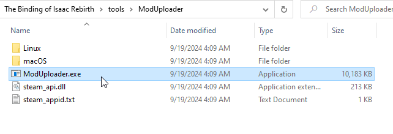
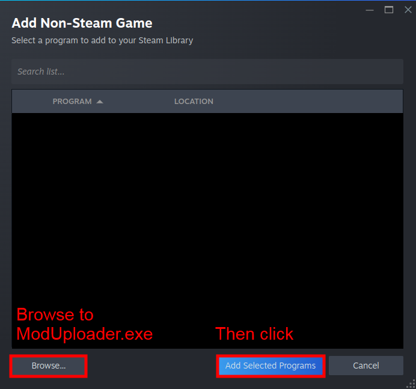



To upload to the Steam Workshop, you must use the mod uploader tool bundled in with the game files.

## Video tutorial

## Using the mod uploader
The mod uploader is a program located in the `tools` folder in the game's directory. If you don't see this folder, **make sure you've extracted the game's resources** by following the [previous tutorial](./creating_a_mod.md) in the crash course. Within the `tools` folder, you'll see `ModUploader.exe`, which is the executable you'll need to launch. The program launched will be titled "The Binding of Isaac: Afterbirth+ Mod Uploader", but this uploader is still functional for Repentance and Repentance+.

???- note "Linux info"
    Linux users may notice a "Linux" folder with a file you can run in the terminal. If you're having issues with this version of the mod uploader, try adding the Windows version as an non-Steam game on Steam, then run it with Proton.

    1. Click the plus (+) at the bottom-left of the Steam app, then click "Add a Non-Steam Game". 
    2. Click "Browse" at the bottom-left of the menu that popped up, and navigate to `ModUploader.exe`. Choose it and click "Add Selected Programs". 
    3. You should now be able to find "ModUploader" in your Steam library. With the ModUploader entry selected, click the gear on the right, then click "Properties". 
    4. Click "Compatibility" on the left, then click "Force use of a specific Steam Play compatibility tool". From this dropdown list, choose "Proton 9.0-4". 
    5. You should be able to launch the mod uploader through Steam and use it normally.

To get started, navigate to your mod folder after clicking "Choose Mod...", then select your `metadata.xml`. This file was generated when launching the game with your mod in your mods folder.

## Editing your mod's metadata
Within the mod uploader, you can edit your mod's metadata, which is the data that shows on the Steam Workshop.

- **1:** This area holds the "Upload Mod" and "View Mod" buttons. "Upload Mod" will upload it to the Steam Workshop with all of your settings, while "View Mod" let's you open the Workshop page in your browser.
- **2:** This allows you to edit the change notes for your release. You can edit this field for both uploads and updates.
- **3:** This holds information about the name of the mod, the version (how many updates the mod has had, also editable in the `metadata.xml`), and which tags to apply to the Workshop page.
    - **If you upload the mod with a version that is not higher than the previous upload, the mod won't properly update for people.**
    - Version is automatically incremented and doesn't appear on the Workshop page or in game.
    - Tags are not editable on the Workshop page.
- **4:** This is the mod's thumbnail. Clicking "Change" allows you to change it to any image. This is blanked out every time you open the mod uploader, but **you do not need to reselect your mod's thumbnail whenever updating the mod.**
    - **Note:** For Windows users, File Explorer will only let you choose png, jpeg, and bmp files. Despite this, it's common to see gif thumbnails on the Workshop. You can work around the limitation and upload a gif as the thumbnail by typing an asterisk (*) into the file name bar at the bottom and pressing enter, which allows you to select any file type.
    - Your mod's thumbnail is not editable on the Workshop page.
- **5:** You can set the visibility of your mod to Public, Friends Only, or Private.
- **6:** The mod description supports Steam's version of BBCode, allowing you to add headers, hyperlinks, bolded text, and more. You can learn how to format your description by clicking [here](https://steamcommunity.com/comment/Guide/formattinghelp).
- **7:** This is the mod uploader log, informing you of any errors in the uploading process.

???- note "Error guide"
    ???+ warning "Note"
        Users who own the game through family sharing **cannot** upload mods, and will either receive error 2 or 9.

    | Error Name | Solution |
    |:--|:--|
    | Error (2) - Unknown error | Delete your mod's `metadata.xml` file and allow the game to generate a new one. Make sure to copy whatever information you entered during the uploading process! |
    | Error (8) - Incorrect parameter | Shorten your description to be under 8000 characters. If it's already under that count, try reselecting the `metadata.xml` file. |
    | Error (9) - File not found | Delete your mod's `metadata.xml` file and allow the game to generate a new one. Make sure to copy whatever information you entered during the uploading process! |
    | Error (15) - Access is denied | Delete your mod's `metadata.xml` file and allow the game to generate a new one. Make sure to copy whatever information you entered during the uploading process! |
    | Error (21) - User is not logged in | You're likely having internet issues. Check your connection and try again. |
    | Error (25) - Limit exceeded | Your thumbnail is too large. **Thumbnails should be under a megabyte (1mb).** |

**You cannot edit the name of your mod in the mod uploader** unlike all of the other properties, so make sure you manually edit it in the `metadata.xml` before uploading.

## Updating your mod
Updating your mod follows the same process as uploading it, meaning you can select your `metadata.xml` and click "Upload Mod" like normal. When your mod is uploaded for the first time, an `id` tag is added in your mod's `metadata.xml` that tells the game what Steam Workshop mod it is for. Only those set as contributors of the mod on Steam can update it.