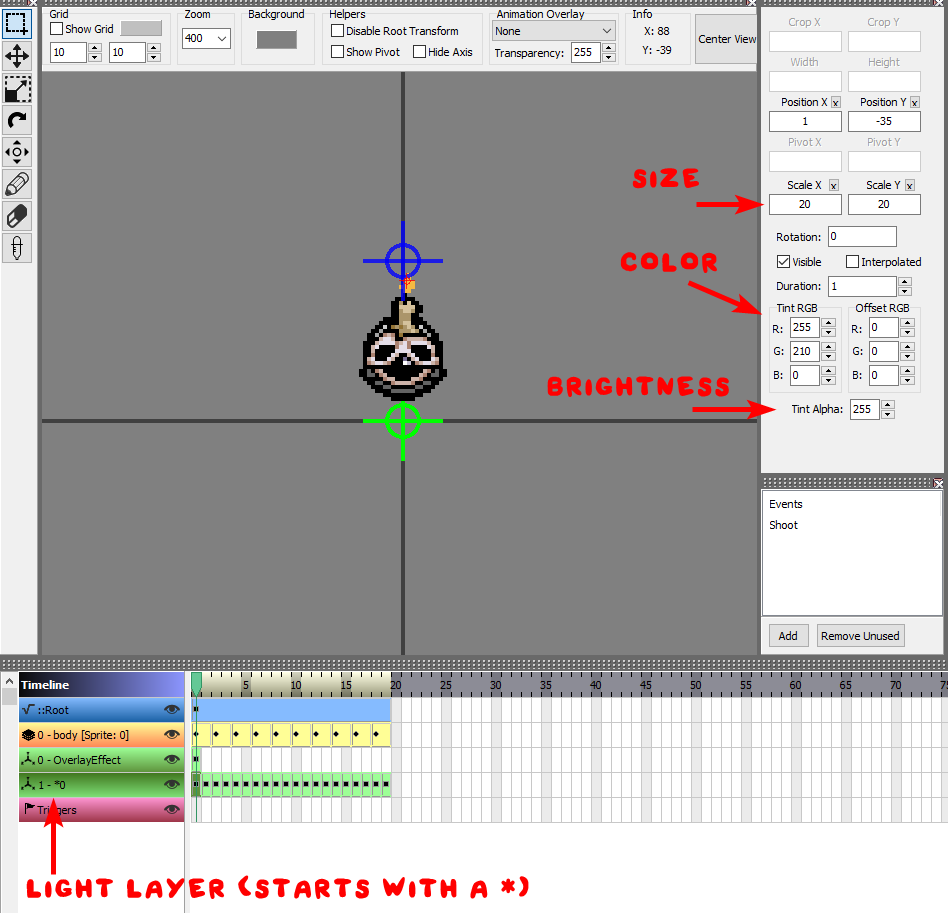

Certain entities make light in the darkness. This is most visible in Mines dark rooms, and with Curse of Darkness. The way this is done is with a **null layer** in the `.anm2` of your Entity.

## Creating a light layer
To create a light layer in an entity's `.anm2`, create a new layer. Make sure you **tick the "Null" box,** and make sure that **the layer name starts with an asterisk (`*`).**

- Edit the `Scale X` and `Scale Y` properties to change the size of the light.
- Edit the `R`, `G`, and `B` properties under `Tint RGB` to edit the color the light.
- Edit the `Tint Alpha` property to edit the brightness of the light.

