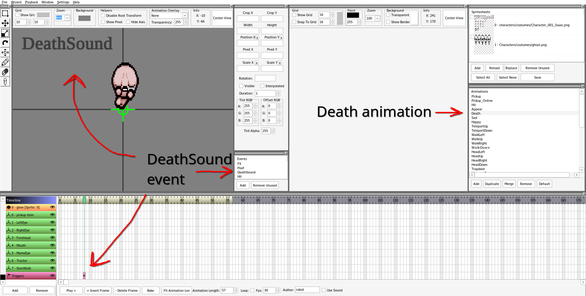

When creating custom characters, it may be desired to alter the sound effect that normally plays for taking damage and dying to better fit the new character. While this can be achieved with relative ease, there is importance in supporting more than one character so it only plays for your character when appropriate.

As this tutorial will be covering usage of a custom character and sound effect, please see the articles for creating new [characters](../crash_course/character.md) and [sound effects](../crash_course/sound_effects.md) for reference.

## Non-REPENTOGON method

Without REPENTOGON, replacing sounds for individual characters must be done with Lua code. The best method of replacing the sounds for only select characters are knowing when they will play and playing your new sound afterwards.

???+ note
    Due to the limitations of the vanilla API, you may hear a split second of the original sound before it stops and your new sound plays. There are more "hacky" methods that involve replacing the original sound files, but they will not be covered in this tutorial.

### Hurt sound detection

The first step is to build the code that will detect when the sounds should be played. The code involved with actually replacing the sounds will be done within a function that, for now, will be left empty and revisited later.

For the hurt sound effect, it plays each time Isaac gets hurt. For this, only the [MC_ENTITY_TAKE_DMG](https://wofsauge.github.io/IsaacDocs/rep/enums/ModCallbacks.html#mc_entity_take_dmg) callback is required.

```Lua
local mod = RegisterMod("My Mod", 1)

local MY_CHAR = Isaac.GetPlayerTypeByName("My Character", false)

--Will fill this function at a later time. Adding as placeholder for now.
local function replacePlayerSound(oldSound)

end

function mod:ReplaceHurtSoundOnTakeDamage(ent)
    --This callback passes an Entity object. Cast to EntityPlayer.
    local player = ent:ToPlayer()
    local playerType = player:GetPlayerType()
    --Check it's your character
    if playerType == MY_CHAR then
        --Trigger your function and pass the sound that should be replaced.
        replacePlayerSound(SoundEffect.SOUND_ISAAC_HURT_GRUNT)
    end
end

--Restrict callback to the player by using EntityType.ENTITY_PLAYER as the optional argument.
--AddPriorityCallback is used on LATE priority instead of the regular AddCallback as many other mods may attempt to cancel the damage, stopping later callbacks.
--This callback will run after most other MC_ENTITY_TAKE_DMG callbacks, making it likely the player will sustain the damage and play the hurt sound.
mod:AddPriorityCallback(ModCallbacks.MC_ENTITY_TAKE_DMG, CallbackPriority.LATE, mod.ReplaceHurtSoundOnTakeDamage, EntityType.ENTITY_PLAYER)
```

### Death sound detection

The death sound effect plays when the "DeathSound" event is triggered. You can view `001.000_player.anm2` inside the game's [extracted resources](creating_a_mod.md#extracting-the-games-resources) and see that it's placed within all of the available death animations.



[MC_POST_PEFFECT_UPDATE](wofsauge.github.io/IsaacDocs/rep/enums/ModCallbacks.html#mc_post_peffect_update) will be used to constantly check when the `DeathSound` event triggers on the player's sprite in order to play the death sound effect. Both this callback and the game's logic run at 30 frames per second, as opposed to [MC_POST_PLAYER_UPDATE](wofsauge.github.io/IsaacDocs/rep/enums/ModCallbacks.html#mc_post_player_update) which runs at 60 frames per second. Since we only need to check once every game update, `MC_POST_PEFFECT_UPDATE` is preferrable.

```Lua
function mod:ReplaceDeathSoundOnPeffectUpdate(player)
    local sprite = player:GetSprite()
    --Check the DeathSound event triggered on the sprite, no matter what animation is playing
    if sprite:IsEventTriggered("DeathSound") then
        replacePlayerSound(SoundEffect.SOUND_ISAACDIES)
    end
end

--MC_POST_PEFFECT_UPDATE accepts a PlayerType as an optional argument. This ensures the callback only runs for your character.
mod:AddCallback(ModCallbacks.MC_POST_PEFFECT_UPDATE, mod.ReplaceDeathSoundOnPeffectUpdate, MY_CHAR)
```

The body left behind by the "Lost Curse" effect, triggered by the [White Fireplace](https://bindingofisaacrebirth.wiki.gg/wiki/Fire_Places#White_Fire_Place) and [Soul of the Lost](https://bindingofisaacrebirth.wiki.gg/wiki/Soul_of_the_Lost), is a separate entity that will also play the sound. It will leave behind a devil statue effect (`EffectVariant.DEVIL`), replace its anm2 file with your character's anm2 file, and play the `Death` animation. As such, an additional callback is needed to account for this.

```Lua
function mod:ReplaceDeathSoundFromDeadBody(effect)
    local sprite = effect:GetSprite()
    --This will store the player if the effect has an assigned SpawnerEntity AND the :ToPlayer() cast succeeds. Otherwise, it'll be set to `nil`.
    local player = effect.SpawnerEntity and effect.SpawnerEntity:ToPlayer()
    if sprite:GetFilename() == "gfx/001.000_player.anm2" --This filename check assures that the effect's anm2 is now a player's anm2, so it should be a dead player body.
        and sprite:IsEventTriggered("DeathSound")
        and player --Ensure the player variable isn't `nil`, meaning this was spawned by a player.
        and player:GetPlayerType() == MY_CHAR --Was spawned by your character.
    then
        --With all these checks combined, this should absolutely be a dead player body from your character. Replace the sound.
        replacePlayerSound(SoundEffect.SOUND_ISAACDIES)
    end
end

--EffectVariant.DEVIL is passed as the optional argument so the callback will only run for the "devil statue".
mod:AddCallback(ModCallbacks.MC_POST_EFFECT_UPDATE, mod.ReplaceDeathSoundFromDeadBody, EffectVariant.DEVIL)
```

### Replacing the sounds

Now that the code to detect when the sound should play for your character is operating, it's time to fill the `replacePlayerSound` function from earlier. The `oldSound` argument will be used for both stopping the old sound and knowing what new sound to play. However, there are a few quirks to make note of:

1. `MC_ENTITY_TAKE_DMG` runs before the entity sustains the damage, and thus the hurt sound effect has not played yet.
2. The death sound effect for when the player dies (not for the Lost Curse) plays twice for an unknown reason, so stopping it once will not stop it fully.
3. For both the player and dead player body's death sounds, by the time the DeathSound sprite event is triggered, the death sound should be already playing.

For all of these cases, the `FrameDelay` and `Volume` parameters for [SFXManager():Play](https://wofsauge.github.io/IsaacDocs/rep/SFXManager.html#play) will be utilized. `FrameDelay` will stop the sound from playing again for however many frames it is set to, and `Volume` will adjust the volume of the sound.

`FrameDelay` by default is already `2`, and by setting the `Volume` to `0`, a silent sound effect can be played that cannot be overridden on the next game update. This will be used to stop the vanilla hurt and death sounds from playing.

```Lua
--Store SFXManager() for later use
local sfxman = SFXManager()
--Get the IDs of your hurt and death sounds
local HURT_SOUND = Isaac.GetSoundIdByName("My Hurt Sound")
local DEATH_SOUND = Isaac.GetSoundIdByName("My Death Sound")

local function replacePlayerSound(oldSound)
    --Play the appropriate sound based on what is passed into `oldSound`.
    if oldSound == SoundEffect.SOUND_ISAAC_HURT_GRUNT then
        sfxman:Play(HURT_SOUND)
    elseif oldSound == SoundEffect.SOUND_ISAACDIES then
        sfxman:Play(DEATH_SOUND)
        --For death sounds, the vanilla sound should already be playing. Stop the sound effect.
        sfxman:Stop(oldSound)
    end
    --Playing the sound at 0 volume will stop the sound from playing on the next game update.
    sfxman:Play(oldSound, 0)
end
```

## :modding-repentogon: REPENTOGON method

REPENTOGON on Repentance+ users can use a much simpler method of adding sounds to your custom character that involves zero Lua code. Within the `players.xml` file, you can define two new variables:

| Variable Name | Value | Comment |
|:--|:--|:--|
|hurtsound|number or string|Any instance of the character playing `SoundEffect.SOUND_ISAAC_HURT_GRUNT` will be replaced with the new sound|
|deathsound|number or string|Any instance of the character playing `SoundEffect.SOUND_ISAACDIES` will be replaced with the new sound|

The following example replaces the custom character's hurt sound with `SoundEffect.SOUND_LEECH` and the death sound with a custom sound effect named "My Death Sound":

`sounds.xml`

```xml
<sounds root="sfx/">
    <sound name="My Death Sound">
        <sample weight="1" path="my_death_sound_effect.wav" />
    </sound>
</sounds>
```

`players.xml`

```xml
<players root="gfx/characters/costumes/"
         portraitroot="gfx/ui/stage/"
         nameimageroot="gfx/ui/boss/">
    <player name="My Character" skin="character_mychar.png" hp="4" armor="4"
          hurtsound="221" deathsound="My Character Death"
          nameimage="playername_mychar.png"
          portrait="playerportrait_mychar.png"
          birthright="???" />
</players>
```
