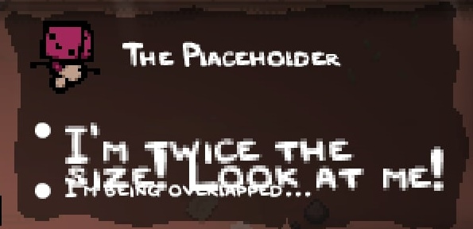

## Introduction
Internal Item Descriptions is the newest addition to Repentance+, being its own version of [External Item Descriptions](https://steamcommunity.com/sharedfiles/filedetails/?id=836319872). It will display detailed information on collectibles, trinkets, pills, and cards when approaching them in a room or viewing them within the "My Stuff" menu. It allows for additional information that will only display based on custom conditions.

Modding support for Internal Item Descriptions is limited, but can still be used.

## Adding custom descriptions
All custom item descriptions are defined in an `info_display.xml` file, located in the `content` folder at the root of your mod folder. Mods can create the `collectibles` tag and the `trinkets` tag.

These tags have no properties, and are intended to be filled with their corresponding child tags `collectible` or `trinket` respectively. The only property these tags have is `id`, which must correspond to the `id` defined for your item in your mod's `items.xml`. These child tags have their own child tag, `info`, where you'll write your descriptions under the `text` property.

???+ warning "No descriptions for cards and pills"
	The `id` variable inside `pocketitems.xml` currently does not supported modded content. As such, **you cannot define custom descriptions for cards, runes, objects, or pills**.

`items.xml`:
```xml
<items gfxroot="gfx/items/" version="1" deathanm2="gfx/death items.anm2">
	<passive id="0" name="The Placeholder" description="He placeholds!" gfx="placeholder.png" />
</items>
```

`info_display.xml`:
```xml
<collectibles>
	<collectible id="0">
		<info text="Be cool and epic"/>
	</collectible>
</collectibles>
```

Result:

<p align="center">
  
</p>
<p align="center">
  
</p>

???+ bug ""My Stuff" display bug"
	Any modded "death item" sprites will appear extremely offset up and to the left from its expected location in the My Stuff menu.
	<br><br>Trinkets will also appear in this menu if consumed via Smelter or similar methods, but there is no support for giving modded trinkets a death item sprite.

## `info` tag

The info tag contains the text to display as a bullet point and can be set to display only under certain conditions.

???- info "`info` tag variables"
	???+ note
		All variables only accept vanilla IDs. Modded content is currently unsupported.
	| Variable Name | Possible Values | Description |
	|:--|:--|:--|
	|text|string|The description for a single bullet point of text|
	|collectible|int|`text` will only be visible if the player has the corresponding collectible.|
	|notcollectible|int|`text` will only be visible if the player does NOT have the corresponding collectible.|
	|player|int|Comma-separated list of [PlayerTypes](https://wofsauge.github.io/IsaacDocs/rep/enums/PlayerType.html). `text` will only be visible if the first player is any of the listed PlayerTypes.|
	|notplayer|int|Comma-separated list of [PlayerTypes](https://wofsauge.github.io/IsaacDocs/rep/enums/PlayerType.html). `text` will only be visible if the first player is NOT any of the listed PlayerTypes.|
	|tag|int|For use with trinkets and pills for golden trinkets and Horse Pills respectively. See [Synergies](internal_item_descriptions.md#synergies) for more information.|

Below is an example of multiple lines of text for our item. The first line is always present, the second line requires you don't have Sad Onion, and the last line requires you do.

```xml
<collectible id="0">
	<info text="+1 Epic Point"/>
	<info notcollectible="1" text="Enemies will cower before you"/>
	<info collectible="1" text="Enemies will be sympathetic towards you."/>
</collectible>
```

<p align="center">
  
</p>

### XML modifiers
XML files use specific symbols for formatting its markup. To insert the characters into text without disrupting the XML format, the following series of characters can be used:

| Name | Character set | Result |
|:--|:--|:--|
|Quotation|`&quot;`|"|
|Apostrophe|`&apos;`|'|
|Less than|`&lt;`|<|
|Greater than|`&gt;`|>|
|Ampersand|`&amp;`|&|

## Text modifiers

Inside the `text` string in an `info` tag, you can insert a specific variable between `&lt;` and `&gt;` to create a special modification to the description.

There are 6 modifiers:

- [`player`](#player) for displaying player heads.
- [`pickup`](#pickup) for displaying pickup icons.
- [`rooms`](#rooms) for displaying room map icons.
- [`collectible`](#collectible) for display vanilla item sprites.
- [`color`](#color) for changing text color.
- [`size`](#size) for changing text size.

`info_display.xml`:
```xml
<collectibles>
    <collectible id="0">
		<info text="&lt;player=0&gt; I'm Isaac!"/>
		<info text="&lt;pickup=bomb&gt; I start with 1 bomb."/>
        <info text="&lt;rooms=9&gt; I need to find the boss..."/>
        <info text="&lt;collectible=1&gt; This is my pet onion."/>
        <info text="It makes me very&lt;color=0xFFf6ff00&gt; happy!" />
        <info text="&lt;size=0.25&gt;okay bye" />
    </collectible>
</collectibles>
```

Result:

<p align="center">
  
</p>

### player

`player` is used for displaying vanilla character heads. The vanilla game doesn't use this at all, but mods can take advantage of it. The value used to choose what icon to display correlates to the frames inside `gfx/ui/text_icons.anm2` file under the "players" animation. The first frame is Isaac's head, so `player=0` will display Isaac's head inside of descriptions.

Below is an example of our item displaying a multitude of player heads:
```xml
<collectible id="0">
	<info text="This is Isaac: &lt;player=0&gt;"/>
	<info text="Here are his friends:&lt;player=1&gt;&lt;player=5&gt;&lt;player=26&gt;"/>
</collectible>
```

<p align="center">
  
</p>

???- info "Player head values"
	| Value | Icon name |
	|:--|:--|
	| 0 | Isaac |
	| 1 | Magdalene |
	| 2 | Cain |
	| 3 | Judas |
	| 4 | ??? (Blue Baby) |
	| 5 | Eve |
	| 6 | Samson |
	| 7 | Azazel |
	| 8 | Lazarus |
	| 9 | Eden |
	| 10 | The Lost |
	| 11 | Lazarus (again) |
	| 12 | Judas (again) |
	| 13 | Lilith |
	| 14 | The Keeper |
	| 15 | Apollyon |
	| 16 | The Forgotten |
	| 17 | The Forgotten (again) |
	| 18 | Bethany |
	| 19 | Jacob (no Esau) |
	| 20 | Jacob (no Esau) (again) |
	| 21 | Tainted Isaac |
	| 22 | Tainted Magdalene |
	| 23 | Tainted Cain |
	| 24 | Tainted Judas |
	| 25 | Tainted ??? (Tainted Blue Baby) |
	| 26 | Tainted Eve |
	| 27 | Tainted Samson |
	| 28 | Tainted Azazel |
	| 29 | Tainted Lazarus |
	| 30 | Tainted Eden |
	| 31 | Tainted The Lost |
	| 32 | Tainted Lilith |
	| 33 | Tainted The Keeper |
	| 34 | Tainted Apollyon |
	| 35 | Tainted The Forgotten |
	| 36 | Tainted Bethany |
	| 37 | Tainted Jacob |
	| 38 | Tainted Lazarus (again) |
	| 39 | Tainted Jacob (again) |
	| 40 | Tainted The Forgotten (again) |

### pickup

`pickup` is used for displaying pickup icons. The vanilla game doesn't use this at all, but mods can take advantage of it. While the pickups displayed are the frames inside the "pickups" animation within `gfx/ui/text_icons.anm2`, `pickup` expects one of 6 specific strings. Providing anything besides these strings displays the coin icon.

Below is an example of our item displaying a multitude of pickup icons:

```xml
<collectible id="0">
        <info text="&lt;pickup=bomb&gt; Boom!"/>
        <info text="A few other pickups: &lt;pickup=coin&gt;&lt;pickup=key&gt;&lt;pickup=blackheart&gt;"/>
</collectible>
```

<p align="center">
  
</p>

???- info "Pickup icon values"
	| Value | Icon name |
	|:--|:--|
	| coin | A penny |
	| key | A key |
	| bomb | A bomb |
	| redheart | A full red heart |
	| soulheart | A full soul heart |
	| blackheart | A full black heart |

### rooms

`rooms` is used for displaying room icons. The vanilla game only uses this for [Teleport 2.0](https://bindingofisaacrebirth.wiki.gg/wiki/Teleport_2.0). The value used to choose what icon to display correlates to the frames inside `gfx/ui/text_icons.anm2` file under the "rooms" animation. The first frame is the shop icon, so `rooms=0` will display the shop icon inside of descriptions.

Below is an example of our item displaying a multitude of room icons:

```xml
<collectible id="0">
	<info text="This is a Shop Icon:&lt;rooms=0&gt;"/>
	<info text="This are several Treasure Room icons:&lt;rooms=4&gt;&lt;rooms=19&gt;&lt;rooms=22&gt;"/>
</collectible>
```

<p align="center">
  
</p>

???- info "Room icon values"
	???+ note "Note"
		Frames 25-85 will appear much smaller than they should, and will cause all other icons in all other descriptions to appear the same shrunken size. This is in part due to the icons not being cropped properly inside the animation file.

	| Value | Icon name |
	|:--|:--|
	| 0 | Shop |
	| 1 | Secret Room |
	| 2 | Super Secret Room |
	| 3 | Library |
	| 4 | Treasure Room |
	| 5 | Angel Room |
	| 6 | Devil Room |
	| 7 | Dice Room |
	| 8 | Mini-Boss Room |
	| 9 | Boss Room |
	| 10 | Challenge Room |
	| 11 | Boss Challenge Room |
	| 12 | Curse Room |
	| 13 | Sacrifice Room |
	| 14 | Arcade |
	| 15 | Vault |
	| 16 | Isaac's Bedroom |
	| 17 | Barren Bedroom |
	| 18 | Locked Room |
	| 19 | Greed (Silver) Treasure Room |
	| 20 | Planetarium |
	| 21 | Teleporter Room |
	| 22 | Red Treasure Room (Devil's Crown) |
	| 23 | Crawlspace |
	| 24 | Heart |
	| 86 | Default Room |
	| 87 | Error Room |

### collectible

`collectible` is used for displaying any vanilla item sprite. The vanilla game doesn't use this at all, but mods can take advantage of it. The value used represents the item's ID. Invalid item IDs will show no sprite.

Note that while you can put in an ID that extends beyond vanilla's maximum item ID, and this ID can make the description show a modded item sprite, modded item IDs shift around depending on what mods are enabled, so this cannot be used to reliably show a modded item sprite.

Below is an example of our item displaying a multitude of items:

```xml
<collectible id="0">
	<info text="The iconic pet onion: &lt;collectible=1&gt;"/>
	<info text="Some other items:&lt;collectible=14&gt;&lt;collectible=654&gt;&lt;collectible=571&gt;"/>
</collectible>
```

<p align="center">
  
</p>

### color

`color` will accept a hexadecimal (shortened as "hex") value to change the color of the text. `color` is commonly used for synergies/interactions with special items, such as [Abyss](https://bindingofisaacrebirth.wiki.gg/wiki/Abyss) and [Book of Virtues](https://bindingofisaacrebirth.wiki.gg/wiki/Book_of_Virtues).

The structure of the color hex code <span style="color: #f833ff">"0xFFf833ff" (pink)</span> is as follows:

- `0x` (characters 1-2): The game is written in C++ and stores colors in hex. Hex is defined starting with `0x`.
- `FF` (characters 3-4): This represents the alpha (transparency) of text. The RGB color format represents red, green, blue, and alpha values from 0 to 255. `FF` in hex translates to 255 in decimal (our standard numeral system).
- `f8` (characters 5-6): This represents the "red" value. "f8" in hex is 170 in decimal.
- `33` (characters 7-8): This represents the "blue" value. "33" in hex is also 33 in decimal.
- `ff` (characters 9-10): This represents the "green" value. "ff" in hex is 255 in decimal

Below is an example of a custom color, and of our item having a red text color modifier while Abyss is held.

```xml
<collectibles>
	<collectible id="0">
		<info text="+1 Epic Point"/>
		<info text="&lt;color=0x2545c1ff&gt;You can barely see me!"/>
		<info collectible="706" text="&lt;color=0xFFc30404&gt;x1 epic locust 1x Isaac's damage"/>
	<collectible />
</collectibles>
```

<p align="center">
  
</p>

Below are all of the hex codes used in vanilla:

- `0xFFc30404`: Abyss locusts/No effect.
- `0xFF4bb3e4`: Book of Virtues wisps.

### size

`size` accepts a float that changes the size of the text. The vanilla game doesn't use this at all, but mods can take advantage of it. `0.5` is the default size of text, so any number lower will make the text smaller and vice versa.

Below is an example of our item with multiple lines of different font sizes:

```xml
<collectible id="0">
	<info text="&lt;size=0.25&gt;I'm half the size!"/>
	<info text="&lt;size=0.5&gt;I'm normal..."/>
	<info text="&lt;size=1&gt;I'm twice the size!"/>
</collectible>
```

<p align="center">
  
</p>

???- bug "Text overlapping"
	Larger font sizes can overlap with text on the next line.
	```xml
	<collectible id="0">
		<info text="&lt;size=1&gt;I'm twice the size! Look at me!"/>
		<info text="&lt;size=0.5&gt;I'm being overlapped..."/>
	</collectible>
	```

	

## Synergies

For each type of item, there are specific important synergies that should be kept in mind. They should be included with the majority of descriptions of that type. Below is a list of synergies for each item type and how to implement them.

### collectible

[**Abyss**](https://bindingofisaacrebirth.wiki.gg/wiki/Abyss)

The locust familiars that spawn when Abyss is used on the item.

Description layout: "x[Amount of locusts spawned] [locust type, if any] locust, x[damage multiplier] Isaac's damage".

```xml
<collectible id="0">
	<info text="Bring me Abyss for a new line"/>
	<info collectible="706" text="&lt;color=0xFFc30404&gt;x1 poison locust 1x Isaac's damage"/>
</collectible>
```

[**Book of Virtues**](https://bindingofisaacrebirth.wiki.gg/wiki/Book_of_Virtues)

The wisp familiars that spawn when Book of Virtues is used with the active item.

Description layout: "x[Amount of wisps spawned] [wisp layer] wisp - [HP amount] hp - [Damage dealt] damage".

```xml
<collectible id="0">
	<info text="Bring me Book of Virtues for a new line"/>
	<info collectible="584" text="&lt;color=0xFF4bb3e4&gt;x1 middle wisp - 2 hp - 3 damage"/>
</collectible>
```

### trinket

**[Mom's Box](https://bindingofisaacrebirth.wiki.gg/wiki/Mom%27s_Box)/[Golden Trinket](https://bindingofisaacrebirth.wiki.gg/wiki/Golden_Trinket)**

The increased effect of a trinket when the player has Mom's Box, or is a golden variant of the trinket. Having multiple of the same trinket will also enact these effects, but is not used within vanilla descriptions. The `tag` variable can be used with trinkets, where setting it to `2` is a default description and `1` is a golden trinket description.

There's a default description, two copies of the same description to display for Mom's Box or a golden trinket, and a final description for both:
```xml
<trinket id="0">
	<info notcollectible="439" tag="2" text="Spawns a coin each time Isaac takes damage"/>
	<info notcollectible="439" tag="1" text="Spawns 2 coins each time Isaac takes damage"/>
	<info collectible="439" tag="2" text="Spawns 2 coins each time Isaac takes damage"/>
	<info collectible="439" tag="1" text="Spawns 3 coins each time Isaac takes damage"/>
</trinket>
```

## Dynamic stats
Descriptions automatically display any stats that your item grants upon pickup. It does this by calling the `EvaluateItems` function internally whenever you're close to the item, which in turn triggers `MC_EVALUATE_CACHE` multiple times per second.

As long as your item or trinket has any entry in `info_display.xml`, the dynamic stats will be able to show up.