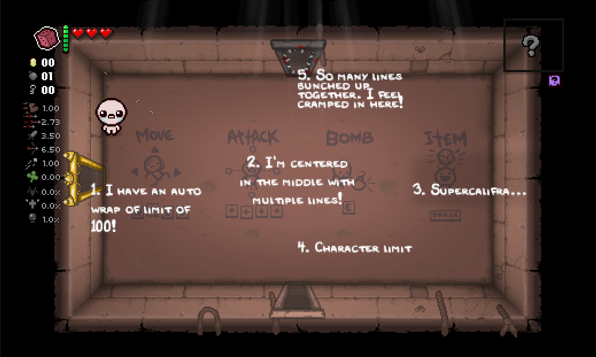
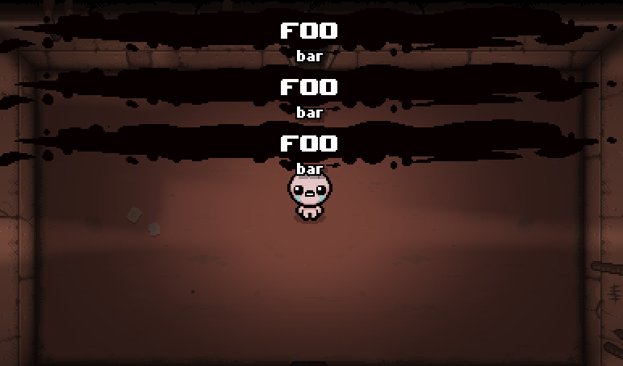



With the addition of the Repentance+ DLC, there have been a few updates to the modding API compared to Repentance. This article will list all of the additions and changes that have been made in the process.

## [Entity](https://wofsauge.github.io/IsaacDocs/rep/Entity.html)

The following functions now have an additional argument: `IgnoreBosses`. When set to `true`, the status effect will ignore the boss status effect cooldown that normally prevents bosses from gaining more status effects:

- [Entity:AddBurn](https://wofsauge.github.io/IsaacDocs/rep/Entity.html#addburn)
- [Entity:AddCharmed](https://wofsauge.github.io/IsaacDocs/rep/Entity.html#addcharmed)
- [Entity:AddFear](https://wofsauge.github.io/IsaacDocs/rep/Entity.html#addfear)
- [Entity:AddFreeze](https://wofsauge.github.io/IsaacDocs/rep/Entity.html#addfreeze)
- [Entity:AddMidasFreeze](https://wofsauge.github.io/IsaacDocs/rep/Entity.html#addmidasfreeze)
- [Entity:AddPoison](https://wofsauge.github.io/IsaacDocs/rep/Entity.html#addpoison)
- [Entity:AddShrink](https://wofsauge.github.io/IsaacDocs/rep/Entity.html#addshrink)
- [Entity:AddSlowing](https://wofsauge.github.io/IsaacDocs/rep/Entity.html#addslowing)

There is one new addition to the Entity class:

- [Entity:KillWithSource](https://wofsauge.github.io/IsaacDocs/rep/Entity.html#killwithsource) is identical to [Entity:Kill](https://wofsauge.github.io/IsaacDocs/rep/Entity.html#kill), but you can define an [EntityRef](https://wofsauge.github.io/IsaacDocs/rep/EntityRef.html) as a source.

## [EntityPlayer](https://wofsauge.github.io/IsaacDocs/rep/EntityPlayer.html)

- [EntityPlayer:AddCollectible](https://wofsauge.github.io/IsaacDocs/rep/EntityPlayer.html#addcollectible) has an additional argument: `ItemPoolType`. This allows you to manually define what item pool the item came from.

## [Font](https://wofsauge.github.io/IsaacDocs/rep/Font.html)

- Three new fonts were added under `gfx/font/teammeatex/`: `teammeatex10`, `teammeatex12`, and `teammeatex16`.

Below is an example render of each size of font, first rendered with their regular version, followed by their EX version:


- A new override to the [Font:DrawString](https://wofsauge.github.io/IsaacDocs/rep/Font.html#drawstring) function has been added that allows you to pass different sizes similarly to [Font:DrawStringScaled](https://wofsauge.github.io/IsaacDocs/rep/Font.html#drawstringscaled) as well as a brand new game object named [FontRenderSettings](https://wofsauge.github.io/IsaacDocs/rep/FontRenderSettings.html), allowing more precise control over how the font is rendered.

Below are 5 different examples of text being rendered in different locations under different font settings:

```Lua
local TestMod = RegisterMod("Font Render Test", 1)

local font = Font("font/teammeatex/teammeatex10.fnt")

--Enables Auto Wrap with a box width of 100. If a string's width reaches past the box width, the string will be cut before the width limit with the remainder of the string being put on a new line.
--The placement of the new line and previous lines is determined by the current alignment.
--Auto Wrap is disabled by default.
local fontSettings1 = FontRenderSettings()
fontSettings1:EnableAutoWrap(100)

--Enables Auto Wrap with a box width of 100 with a MIDDLE_CENTER alignment. Text will be centered at the render point and lines will be pushed upwards with each new line.
--Default alignment is DrawStringAlignment.TOP_LEFT (0).
local fontSettings2 = FontRenderSettings()
fontSettings2:SetAlignment(DrawStringAlignment.MIDDLE_CENTER)
fontSettings2:EnableAutoWrap(100)

--Enables truncation with a box width of 100. If a string's width reeaches past the box width, the string will be cut before the width limit and append a "..." at the end.
--Truncation is disabled by default. Has no effect if Auto Wrap is enabled.
local fontSettings3 = FontRenderSettings()
fontSettings3:EnableTruncation(100)

--Sets a maximum amount of characters that can be rendered on the string to 18. If a string's width reaches past the box width, the remaining characters will not be rendered.
--Default character limit is 65535.
local fontSettings4 = FontRenderSettings()
fontSettings4:SetMaxCharacters(18)

--Enables Auto Wrap with a box width of 100 with a Line Height modifier of 0.5. The distance between lines can be made smaller or larger.
--Default line height is 1.0. Has no effect if Auto Wrap isn't enabled.
local fontSettings5 = FontRenderSettings()
fontSettings5:EnableAutoWrap(100)
fontSettings5:SetLineHeightModifier(0.5)

function TestMod:OnRender()
	local centerPos = Vector(Isaac.GetScreenWidth() / 2, Isaac.GetScreenHeight() / 2)
	font:DrawString("1. I have an auto wrap of limit of 100!", centerPos.X - 180, centerPos.Y, 1, 1, KColor(1,1,1,1), fontSettings1)
	font:DrawString("2. I'm centered in the middle with multiple lines!", centerPos.X, centerPos.Y, 1, 1, KColor(1,1,1,1), fontSettings2)
	font:DrawString("3. Supercalifragilisticexpialidocious", centerPos.X + 100, centerPos.Y, 1, 1, KColor(1,1,1,1), fontSettings3)
	font:DrawString("4. Character limit stops most of this from rendering...", centerPos.X, centerPos.Y + 50, 1, 1, KColor(1,1,1,1), fontSettings4)
	font:DrawString("5. So many lines bunched up together. I feel cramped in here!", centerPos.X, centerPos.Y - 100, 1, 1, KColor(1,1,1,1), fontSettings5)
end

TestMod:AddCallback(ModCallbacks.MC_POST_RENDER, TestMod.OnRender)
```



## [Game](https://wofsauge.github.io/IsaacDocs/rep/Game.html)

- [Game:Fadein](https://wofsauge.github.io/IsaacDocs/rep/Game.html#fadein) has two new arguments: `ShowIcon` and `KColor`. `ShowIcon` appears to be non-functional. `KColor` will change the color of the screen as it fades back into the view of the game.

Demonstration using `Game():Fadein(0.025, true, KColor(0.5, 0.5, 0.5, 1))`:


- [Game:Fadeout](https://wofsauge.github.io/IsaacDocs/rep/Game.html#fadeout) has one new argument: `KColor`. It will change the color of the screen that it will fade out into.

Demonstration using `Game():Fadeout(0.025, 2, KColor(0.5, 0.5, 0.5, 1))`:


## [GridEntity](https://wofsauge.github.io/IsaacDocs/rep/GridEntity.html)

- [GridEntity:DestroyWithSource](https://wofsauge.github.io/IsaacDocs/rep/GridEntity.html#destroywithsource) is identical to [GridEntity:Destroy](https://wofsauge.github.io/IsaacDocs/rep/GridEntity.html#destroy), but you can define an [EntityRef](https://wofsauge.github.io/IsaacDocs/rep/EntityRef.html) as a source.
- [GridEntity:HurtWithSource](https://wofsauge.github.io/IsaacDocs/rep/GridEntity.html#hurtwithsource) is identical to [GridEntity:Hurt](https://wofsauge.github.io/IsaacDocs/rep/GridEntity.html#hurt), but you can define an [EntityRef](https://wofsauge.github.io/IsaacDocs/rep/EntityRef.html) as a source.

## HUD

A new argument has been added to both overrides of [HUD:ShowItemText](https://wofsauge.github.io/IsaacDocs/rep/HUD.html?h=hud#showitemtext): `ClearStack`. In Repentance+, HUD item text now stacks, showing one HUD text below the last one if its still on screen. The argument is `true` by default, which will resort to the behaviour of Repentance HUD text of removing all existing HUD text on screen before displaying the new one.

Example:

Repeating the following function 3 times will only show it once:

```Lua
Game():GetHUD():ShowItemText("foo", "bar", false)
```


Doing the same thing again, but passing `ClearStack` as `false`, will show all three messages:

```Lua
Game():GetHUD():ShowItemText("foo", "bar", false, false)
```



## [ItemPool](https://wofsauge.github.io/IsaacDocs/rep/ItemPool.html)

[ItemPool:GetCollectible](https://wofsauge.github.io/IsaacDocs/rep/ItemPool.html#getcollectible) has an additional argument: `BackupPoolType`. Accepts an [ItemPoolType] such that if the regular pool in `PoolType` is empty and `DefaultItem` is set to `CollectibleType.COLLECTIBLE_NULL`, it will draw from `BackupPoolType` instead of `ItemPoolType.POOL_TREASURE`.

???+ info "Not available with REPENTOGON"
	This addition was added in a later update to Repentance+ after v1.9.7.12, so it is not available to REPENTOGON users.

Example:

After draining the library pool, this would normally return a treasure room item:

```Lua
Game():GetItemPool():GetCollectible(ItemPoolType.POOL_LIBRARY, true)
```

However, defining `BackupPoolType` with `ItemPoolType.POOL_DEVIL` will return an item from the devil item pool instead:

```Lua
Game():GetItemPool():GetCollectible(ItemPoolType.POOL_LIBRARY, true, nil, nil, ItemPoolType.POOL_DEVIL)
```

(NOTE: Doesn't appear to work in REPENTOGON? Wonder if its a latest vanilla version addition.)

## [Room](https://wofsauge.github.io/IsaacDocs/rep/Room.html)

- [Room:DamageGridWithSource](https://wofsauge.github.io/IsaacDocs/rep/Room.html#damagegridwithsource) is identical to [Room:DamageGrid](https://wofsauge.github.io/IsaacDocs/rep/Room.html#damagegrid), but you can define an [EntityRef](https://wofsauge.github.io/IsaacDocs/rep/EntityRef.html) as a source.
- [Room:DestroyGridWithSource](https://wofsauge.github.io/IsaacDocs/rep/Room.html#destroygridwithsource) is identical to [Room:DestroyGrid](https://wofsauge.github.io/IsaacDocs/rep/Room.html#destroygrid), but you can define an [EntityRef](https://wofsauge.github.io/IsaacDocs/rep/EntityRef.html) as a source.
- [Room:MamaMegaExplosion](https://wofsauge.github.io/IsaacDocs/rep/Room.html#mamamegaexplosion)'s `Position` argument is now optional, placed at `Vector.Zero` by default. It also has an additional optional argument to pass an [EntityPlayer](https://wofsauge.github.io/IsaacDocs/rep/EntityPlayer.html) as the source of the explosion.

## [Sprite](https://wofsauge.github.io/IsaacDocs/rep/Sprite.html)

- [Sprite:ReplaceSpritesheet](https://wofsauge.github.io/IsaacDocs/rep/Sprite.html#replacespritesheet) now returns a `boolean` instead of `nil`. It will return `true` if the spritesheet at the given layer id was successfully replaced *and* if the new spritesheet is not the same as the old one, otherwise returns `false`.

## [Options](https://wofsauge.github.io/IsaacDocs/rep/Options.html)

- One new variable: [Options.JacobEsauControls](https://wofsauge.github.io/IsaacDocs/rep/Options.html#jacobesaucontrols). `0` for "Classic" controls, `1` for "Better" controls.

## Enums

The following new enums have been added:

- [DrawStringAlignment](https://wofsauge.github.io/IsaacDocs/rep/enums/DrawStringAlignment.html): For use in `FontRenderSettings`

The following enums have been updated with new entries:

- [BackdropType](https://wofsauge.github.io/IsaacDocs/rep/enums/BackdropType.html): New additions are `DEATHMATCH` and `LIL_PORTAL`. `NUM_BACKDROPS` has been updated to reflect this.
- [ButtonAction](https://wofsauge.github.io/IsaacDocs/rep/enums/ButtonAction.html): Many pre-existing enumerations have been switched around with new values. New additions are `ACTION_JOINMULTIPLAYER`, `ACTION_MENUX`, and `ACTION_EMOTES`.
- [EffectVariant](https://wofsauge.github.io/IsaacDocs/rep/enums/EffectVariant.html): `BULLET_POOF_STATIC` and `UMBILICAL_CORD_HELPER` were added, but were existing Repentance entities previously without enumerations. New additions are `MEGA_BEAN_EXPLOSION`, `SPAWN_PENTAGRAM`, and `PLAYER_CREEP_YELLOW`.
- [GameStateFlag](https://wofsauge.github.io/IsaacDocs/rep/enums/GameStateFlag.html): New additions are `STATE_MEGA_SATAN_DOOR_OPENED`, `STATE_URIEL_KILLED`, `STATE_GABRIEL_KILLED`, and `STATE_MOTHER_HEART_DOOR_OPENED`. `NUM_STATE_FLAGS` has been updated to reflect this.
- [GridRooms](https://wofsauge.github.io/IsaacDocs/rep/enums/GridRooms.html): New additions are `ROOM_DEATHMATCH_IDX` and `ROOM_LIL_PORTAL_IDX`. `NUM_OFF_GRID_ROOMS` has been updated to reflect this.
- [Music](https://wofsauge.github.io/IsaacDocs/rep/enums/Music.html): The one new addition is `MUSIC_DEATHMATCH`. `NUM_MUSIC` has been updated to reflect this.
- [RoomType](https://wofsauge.github.io/IsaacDocs/rep/enums/RoomType.html): The one new addition is `ROOM_DEATHMATCH`. `NUM_ROOMTYPES` has been updated to reflect this.
- [SoundEffect](https://wofsauge.github.io/IsaacDocs/rep/enums/SoundEffect.html): Has a large quantity of new sound effects.
