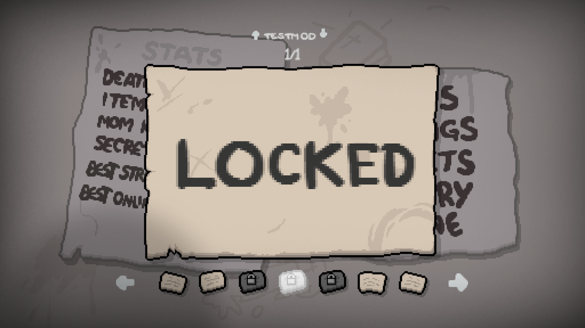

Achievements lock content in the game that must be unlocked to access, or exist for displaying milestones. This tutorial will cover how to create custom achievements and make use of them.

## Adding custom achievements

All custom achievements are defined in a [`achievements.xml`](https://repentogon.com/xml/achievements.html) file, located in the `content` folder at the root of your mod folder. In this folder, there must be a root `achievements` tag. This tag has a `gfxroot` property, which should point to the root directory of where your achievements are stored starting from your mod's `resources` folder. They should usually be stored in `gfx/ui/achievement/`.

```xml
<achievements gfxroot="gfx/ui/achievement/">

</achievements>
```

When defining a new achievement, you use an `achievement` tag alongside any of the available properties below. `name` is required while all others are optional:

???+ info "`achievement` tag variables"
	| Variable Name | Possible Values | Description |
	|:--|:--|:--|
	| name | string | Required. Name of the achievement used for the GetAchievementIdByName function (when this is not present, `text` is used instead). |
	| text | string | Text description of the achievement. Has no functional purpose. |
	| gfxback | string | Path of the png sprite to use as a background paper for the achievement. |
	| hidden | bool | Set to 'true' to make it not show the achievement popup on unlock nor display the achievement in the secrets menu |

```xml
<achievements gfxroot="gfx/ui/achievement/">
	<achievement name="My new Achievement" gfx="achievement_placeholder.png" />
</achievements>
```

Once added, you can go into the Secrets menu and view your mod's achievements by pressing up/down.



## Unlocking/locking achievements

With your achievement added, you can manage whether your achievement is locked or unlocked through the debug console or through Lua.

### Debug console

For the debug console, there's two commands: `achievement` and `lockachievement`. `achievement` will unlock any achievement in the game, while `lockachievement` locks it.


### Lua

Through Lua, your first step should be using [Isaac.GetAchievementIdByName](https://repentogon.com/Isaac.html#getachievementidbyname) in order to obtain the ID for your achievement. Then, when you wish to unlock your acheivement, there are two functions located under [PersistentGameData](https://repentogon.com/PersistentGameData.html): [TryUnlock](https://repentogon.com/PersistentGameData.html#tryunlock) and [Unlocked](https://repentogon.com/PersistentGameData.html#unlocked). You can use the `Unlocked` function to check if the achievement is unlocked or not, and `TryUnlock` to unlock the achievement. Locking achievements can be done through [Isaac.ExecuteCommand](https://wofsauge.github.io/IsaacDocs/rep/Isaac.html#executecommand) and using the `lockachievement` command.

???+ note "Loading achievements before a file is selected"
	Attempting to unlock achievements before the game is loaded will show the achievement unlocking, but will not unlock for any save files. Checking if the achievement is unlocked will always return false. Restrict to using these functions under callbacks that would run after the game is fully loaded.

This `main.lua` code will unlock the new achievement after collecting Sad Onion.
```Lua
local mod = RegisterMod("My Mod", 1)
local MY_ACHIEVEMENT = Isaac.GetAchievementIdByName("My new Achievement")
local persistGameData = Isaac.GetPersistentGameData()

function mod:OnSadOnionPickup()
	if not persistGameData:Unlocked(MY_ACHIEVEMENT) then
		persistGameData:TryUnlock(MY_ACHIEVEMENT)
	end
end

mod:AddCallback(ModCallbacks.MC_POST_ADD_COLLECTIBLE, mod.OnSadOnionPickup, CollectibleType.COLLECTIBLE_SAD_ONION)
```
