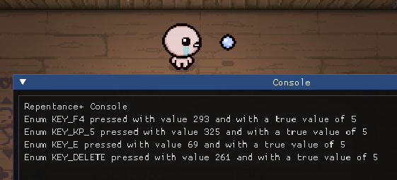

Game controllers can complicate detecting arbitrary button presses.

## Controller detection
Controllers can easily be detected by reading the [`ControllerIndex`](https://wofsauge.github.io/IsaacDocs/rep/EntityPlayer.html#controllerindex) property of the player. If it is above `0`, then the player must be using a controller, as `0` is always the `ControllerIndex` of the keyboard.
```lua
local player = Isaac.GetPlayer(0)
print(player.ControllerIndex)
```

## Controllers and `Input.IsButtonTriggered/Pressed()`
Controllers *can* be detected by [`Input.IsButtonTriggered()`](https://wofsauge.github.io/IsaacDocs/rep/Input.html#isbuttontriggered) and [`Input.IsButtonPressed()`](https://wofsauge.github.io/IsaacDocs/rep/Input.html#isbuttonpressed), but not without some caveats.

Firstly, controller inputs don't have a value in the [`Keyboard`](https://wofsauge.github.io/IsaacDocs/rep/enums/Keyboard.html) enum, but they do have a number which corresponds to what button you're pressing.
```lua
local controllerButtons = {
    DPAD_LEFT = 0,
    DPAD_RIGHT = 1,
    DPAD_UP = 2,
    DPAD_DOWN = 3,
    ACTION_DOWN = 4,
    ACTION_RIGHT = 5,
    ACTION_LEFT = 6,
    ACTION_UP = 7,
    BUMPER_LEFT = 8,
    TRIGGER_LEFT = 9,
    STICK_LEFT = 10,
    BUMPER_RIGHT = 11,
    TRIGGER_RIGHT = 12,
    STICK_RIGHT = 13,
    SELECT = 14,
    START = 15
}
```

Secondly, **controllers trigger multiple values at once.** Pressing a button on the controller will trigger 4 different values in the `Keyboard` enumerator. This can cause complications for detecting keyboard input, because a controller can trigger a value that you're not expecting.



???- info "Reproduction code"
    ```lua
    local mod = RegisterMod("Input test mod", 1)

    mod:AddCallback(ModCallbacks.MC_POST_RENDER, function ()
        for i, v in pairs(Keyboard) do
            if Input.IsButtonTriggered(v, Isaac.GetPlayer().ControllerIndex) then
                print("Enum", i, "pressed with value", v, "and with a true value of", v % 32)
            end
        end
    end)
    ```

To detect if a *keyboard* button was triggered by a controller, you can modulo the input by 32. This will always return the correct value of the button pressed.
```lua
local function safeKeyboardTriggered(key, controllerIndex)
    return Input.IsButtonTriggered(key, controllerIndex) and not Input.IsButtonTriggered(key % 32, controllerIndex)
end
```