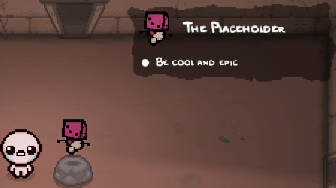



## Introduction
Internal Item Descriptions is the newest addition to Repentance+, being its own version of [External Item Descriptions](https://steamcommunity.com/sharedfiles/filedetails/?id=836319872). It will display detailed information on collectibles, trinkets, pills, and cards, when approaching them in a room or viewing them within the "My Stuff" menu. It allows for additional information that will only display based on custom conditions.

## Adding custom descriptions
All custom item descriptions are defined in an `info_display.xml` file, located in the `content` folder at the root of your mod folder. You can create any of the following tags: `collectibles` or `trinkets`. These tags have no properties, intending to be filled with their corresponding child tags `collectible` or `trinket` respectively. The only property these tags have is `id`, which must correspond to the `id` defined in your item's `items.xml`. These child tags have their own child tag: `info`, where you'll write your descriptions under the `text` property.

???+ warning "No descriptions for cards and pills"
	The `id` variable inside `pocketitems.xml` currently does not supported modded content. As such, **you cannot define custom descriptions for cards, runes, objects, or pills**.

items.xml
```xml
<items gfxroot="gfx/items/" version="1" deathanm2="gfx/death items.anm2">
	<passive id="0" name="The Placeholder" description="He placeholds!" gfx="placeholder.png" />
</items>
```

info_display.xml
```xml
<collectibles>
	<collectible id="0">
		<info text="Be cool and epic"/>
	</collectible>
</collectibles>
```

Result:



???+ bug "My Stuff display bug"
	Any modded "death item" sprites will appear extremely offset up and to the left from its expected location in the My Stuff menu.
	<br><br>Trinkets will also appear in this menu if consumed via Smelter or similar methods, but there is no support for giving modded trinkets a death item sprite.

## Customizing descriptions

With the vast quantity of items available in the vanilla game, there are a few methods to customize descriptions.

### info tag

The info tag contains the text to display as a bullet point and can be set to display only under certain conditions.

???- info "`info` tag variables"
	???+ note
		All variables only accept vanilla IDs. Modded content is currently unsupported.
	| Variable Name | Possible Values | Description |
	|:--|:--|:--|
	|text|string|The description for a single bullet point of text|
	|collectible|int|`text` will only be visible if the player has the corresponding collectible.|
	|notcollectible|int|`text` will only be visible if the player does NOT have the corresponding collectible.|
	|player|int|Comma-separated list of PlayerTypes. `text` will only be visible if the first player is any of the listed PlayerTypes|
	|notplayer|int|Comma-separated list of PlayerTypes. `text` will only be visible if the first player is NOT any of the listed PlayerTypes|
	|tag|int|For use with trinkets and pills for golden trinkets and Horse Pills respectively. See [Synergies](internal_item_descriptions.md#synergies) for more information.|

Below is an example of multiple lines of text for our item. The first line is always present, the second line requires you have Sad Onion, and the last line requires you don't.
```xml
<collectible id="0">
	<info text="+1 Epic Point"/>
	<info notcollectible="1" text="Enemies will cower before you"/>
	<info collectible="1" text="Enemies will be sympathetic towards you."/>
</collectible>
```


### Text modifiers

Inside the `text` string, you can insert a specific variable between `&lt;` and `&gt;` to create a special modification to the description. Currently there are only two modifiers: `color` for changing text color, and `rooms` for displaying room icons

**color**

`color` will accept a HEX code to change the color of the text. It is commonly used for synergies/interactions with special items, such as Abyss and Book of Virtues.

Below is an example of our item having a red text color modifier while having Abyss:
```xml
<collectible id="0">
	<info text="+1 Epic Point"/>
	<info collectible="706" text="&lt;color=0xFFc30404&gt;x1 epic locust 1x Isaac's damage"/>
</collectible>
```


Below are the currently known HEX codes and their use cases in vanilla descriptions:

- 0xFFc30404: Abyss locusts/No effect
- 0xFF4bb3e4: Book of Virtues wisps

**rooms**

`rooms` is used for displaying room icons. The vanilla game only uses this for [Teleport 2.0](https://bindingofisaacrebirth.wiki.gg/wiki/Teleport_2.0). The value used to choose what icon to display correlates to the frames inside `gfx/ui/text_icons.anm2` file under the "rooms" animation. The first frame is the shop icon, so `rooms=0` will display the shop icon inside descriptions.

Below is an example of our item displaying a multitude of room icons:
```xml
<collectible id="0">
	<info text="This is a Shop Icon:&lt;rooms=0&gt;"/>
	<info text="This are several Treasure Room icons:&lt;rooms=4&gt;&lt;rooms=19&gt;&lt;rooms=22&gt;"/>
</collectible>
```


???- info "Room icon values"
	| Value | Icon name |
	|:--|:--|
	| 0 | Shop |
	| 1 | Secret Room |
	| 2 | Super Secret Room |
	| 3 | Library |
	| 4 | Treasure Room |
	| 5 | Angel Room |
	| 6 | Devil Room |
	| 7 | Dice Room |
	| 8 | Mini-Boss Room |
	| 9 | Boss Room |
	| 10 | Challenge Room |
	| 11 | Boss Challenge Room |
	| 12 | Curse Room |
	| 13 | Sacrifice Room |
	| 14 | Arcade |
	| 15 | Vault |
	| 16 | Isaac's Bedroom |
	| 17 | Barren Bedroom |
	| 18 | Locked Room |
	| 19 | Greed (Silver) Treasure Room |
	| 20 | Planetarium |
	| 21 | Teleporter Room |
	| 22 | Red Treasure Room (Devil's Crown) |
	| 23 | Crawlspace |
	| 24 | Heart |
	| 86 | Default Room |
	| 87 | Error Room |

???- notes "Additional notes"
	- Frames 25-85 will appear much smaller than they should, and will cause all other icons in all other descriptions to appear the same shrunken size. This is in part due to the icons not being cropped properly inside the animation file.
	- While there are `players` and `pickups` animations present in the anm2, attempting to use these as a text modifier will not render anything.

**XML escape characters**

XML files use specific symbols for formatting its code. To insert the characters into text without disrupting the XML format, the following series of characters can be used:

| Name | Character set | Result |
|:--|:--|:--|
|Quotation|`&quot;`|"|
|Apostrophe|`&apos;`|'|
|Less than|`&lt;`|<|
|Greater than|`&gt;`|>|
|Ampersand|`&amp;`|&|

## Synergies

For each type of item, there are specific important synergies that should be kept in mind. They should be included with the majority of descriptions of that type. Below is a list of synergies for each item type and how to implement them.

### collectibles

**[Abyss](https://bindingofisaacrebirth.wiki.gg/wiki/Abyss)**

The locust familiars that spawn when Abyss is used on the item.

Description layout: "x(Amount of locusts spawned) (locust type, if any) locust, x(damage multiplier) Isaac's damage".

```xml
<collectible id="0">
	<info text="Bring me Abyss for a new line"/>
	<info collectible="706" text="&lt;color=0xFFc30404&gt;x1 poison locust 1x Isaac's damage"/>
</collectible>
```

**[Book of Virtues](https://bindingofisaacrebirth.wiki.gg/wiki/Book_of_Virtues)**

The wisp familiars that spawn when Book of Virtues is used with the active item.

Description layout: "x(Amount of wisps spawned) (wisp layer) wisp - (HP amount) hp - (Damage dealt) damage".

```xml
<collectible id="0">
	<info text="Bring me Book of Virtues for a new line"/>
	<info collectible="584" text="&lt;color=0xFF4bb3e4&gt;x1 middle wisp - 2 hp - 3 damage"/>
</collectible>
```

### trinkets

**[Mom's Box](https://bindingofisaacrebirth.wiki.gg/wiki/Mom%27s_Box)/[Golden Trinket](https://bindingofisaacrebirth.wiki.gg/wiki/Golden_Trinket)**

The increased effect of a trinket when the player has Mom's Box or it is a golden variant of the trinket. Having multiple of the same trinket will techhnically also enact these effects, but it is not used within vanilla descriptions. The `tag` variable can be used with trinkets, where setting it to `2` is a default description and `1` is a golden trinket description.

There's a default description, two copies of the same description to display for Mom's Box or a golden trinket, and a final description for both:
```xml
<trinket id="0">
	<info notcollectible="439" tag="2" text="Spawns a coin each time Isaac takes damage"/>
	<info notcollectible="439" tag="1" text="Spawns 2 coins each time Isaac takes damage"/>
	<info collectible="439" tag="2" text="Spawns 2 coins each time Isaac takes damage"/>
	<info collectible="439" tag="1" text="Spawns 3 coins each time Isaac takes damage"/>
</trinket>
```

## Dyanmic stats
TODO!