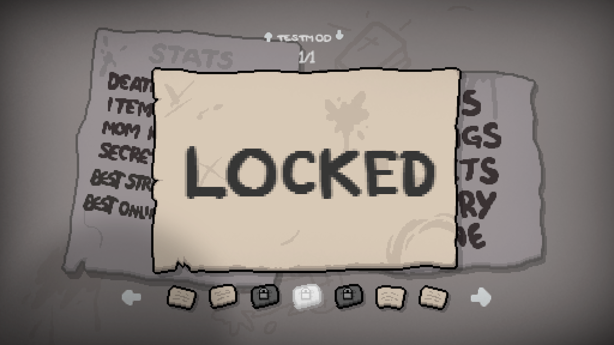
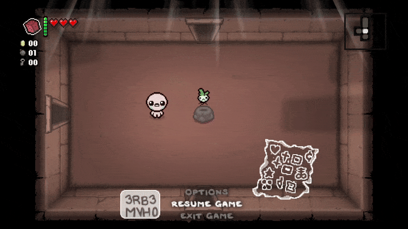



Achievements can lock access to content in the game that must be unlocked to access, or exist for displaying milestones. This tutorial will cover how to create custom achievements and make use of them.

## Adding custom achievements

All custom achievements are defined in an [`achievements.xml`](https://repentogon.com/xml/achievements.html) file, located in the `content` folder at the root of your mod folder. In this folder, there must be a root `achievements` tag. This tag has a `gfxroot` property, which should point to the root directory of where your achievements are stored starting from your mod's `resources` folder. This is usually `gfx/ui/achievement/`, as that's where the vanilla game stores them.

```xml
<achievements gfxroot="gfx/ui/achievement/">

</achievements>
```

When defining a new achievement, you use an `achievement` tag alongside any of the available properties below. `name` is required while all others are optional.

???+ info "`achievement` tag variables"
	| Variable Name | Possible Values | Description |
	|:--|:--|:--|
	| name | string | Required. Name of the achievement used for the GetAchievementIdByName function (when this is not present, `text` is used instead). |
	| text | string | Text description of the achievement. Has no functional purpose. |
	| gfxback | string | Path of the `.png` sprite to use as a background paper for the achievement. |
	| hidden | bool | Set to `true` to make it not show the achievement popup on unlock nor display the achievement in the secrets menu. |

```xml
<achievements gfxroot="gfx/ui/achievement/">
	<achievement name="My new Achievement" gfx="achievement_placeholder.png" />
</achievements>
```

Once added, you can go into the Secrets menu and view your mod's achievements by pressing up/down.



## Unlocking/locking achievements

With your achievement added, you can manage whether your achievement is locked or unlocked through the debug console or through Lua.

### Debug console

For the debug console, there's two commands: `achievement` and `lockachievement`. `achievement` will unlock any achievement in the game, while `lockachievement` locks it.

<p align="center">
  
</p>

<p align="center">
  
</p>

### Lua

Through Lua, your first step should be using [Isaac.GetAchievementIdByName](https://repentogon.com/Isaac.html#getachievementidbyname) in order to obtain the ID for your achievement. Then, when you wish to unlock your achievement, using `Isaac.GetPersistentGameData()` will return a [PersistentGameData](https://repentogon.com/PersistentGameData.html) object.

Two of PersistentGameData's functions will be used in this tutorial:

- [TryUnlock](https://repentogon.com/PersistentGameData.html#tryunlock) attempts to unlock any given achievement. Can optionally be given an second argument that will block the paper pop-up while still unlocking the achievement, but only for modded achievements.
- [Unlocked](https://repentogon.com/PersistentGameData.html#unlocked) Checks if the achievement is unlocked or not.

Locking achievements can be done through [Isaac.ExecuteCommand](https://wofsauge.github.io/IsaacDocs/rep/Isaac.html#executecommand) and using the `lockachievement` command.

???+ warning "Loading achievements before a file is selected"
	Using `PersistentGameData`'s functions before the game is loaded will modify a non-existent save file. `TryUnlock` will show the achievement unlocking, but will not unlock for any save files. `Unlocked` will always return `false`.

	Only use these functions under callbacks that would run after the game has fully loaded.

This `main.lua` code will unlock the new achievement after collecting Sad Onion.
```Lua
local mod = RegisterMod("My Mod", 1)
local MY_ACHIEVEMENT = Isaac.GetAchievementIdByName("My new Achievement")
local persistGameData = Isaac.GetPersistentGameData()

--Set this to true to block the pop-up (only for modded achievements)
local SHOULD_BLOCK_POPUP = false

function mod:OnSadOnionPickup()
	if not persistGameData:Unlocked(MY_ACHIEVEMENT) then
		persistGameData:TryUnlock(MY_ACHIEVEMENT, SHOULD_BLOCK_POPUP)
	end
end

mod:AddCallback(ModCallbacks.MC_POST_ADD_COLLECTIBLE, mod.OnSadOnionPickup, CollectibleType.COLLECTIBLE_SAD_ONION)

--Locking achievements are usually reserved for debugging purposes, but this is present merely for the purposes of this tutorial.
function mod:OnSadOnionLose()
	if persistGameData:Unlocked(MY_ACHIEVEMENT) then
		Isaac.ExecuteCommand("lockachievement " .. MY_ACHIEVEMENT)
	end
end
mod:AddCalback(ModCallbacks.MC_POST_TRIGGER_COLLECTIBLE_REMOVED, mod.OnSadOnionLose, CollectibleType.COLLECTIBLE_SAD_ONION)
```



Keep in mind that due to how the game handles achievement papers appearing, papers might not pop-up immediately and may require entering a new floor or ending a run. If the player has the "pop-ups" setting disabled, they won't see achievement papers at all.

## Locking content behind achievements

The most powerful utility of achievements is naturally locking modded content behind achievements. For any XML files that have an `achievement` variable available, you can insert the name of your achievement to prevent that content from appearing in normal gameplay unless the achievement was previously obtained.

The following XML files have an achievement variable available to utilize:

- [items.xml](https://repentogon.com/xml/items.html) for locking items and trinket.
- [pocketitems.xml](https://repentogon.com/xml/pocketitems.html) for locking cards, runes, objects, and pills.
- [challenges.xml](https://repentogon.com/xml/challenges.html) for locking challenges.
- [players.xml](https://repentogon.com/xml/players.html) for locking characters.

???- "`challenges.xml` achievement variables"
	`challenges.xml` is a special case with multiple achievement-related variables.

	- `achievements` instead of `achievement` for a comma-separated list of achievements, so that multiple can be required to unlock it.
	- `unlockachievement` will unlock the assigned achievement after the challenge is completed.
	- `lockeddesc` can be used to show a special message while the achievement is locked instead of the default "LOCKED :("

This `items.xml` code will prevent this custom item from appearing in item pools until our achievement is unlocked.

```xml
<items gfxroot="gfx/items/" version="1" deathanm2="gfx/death items.anm2">
	<passive id="0" name="The Placeholder" description="He placeholds!" gfx="placeholder.png" achievement="My new Achievement" />
</items>
```